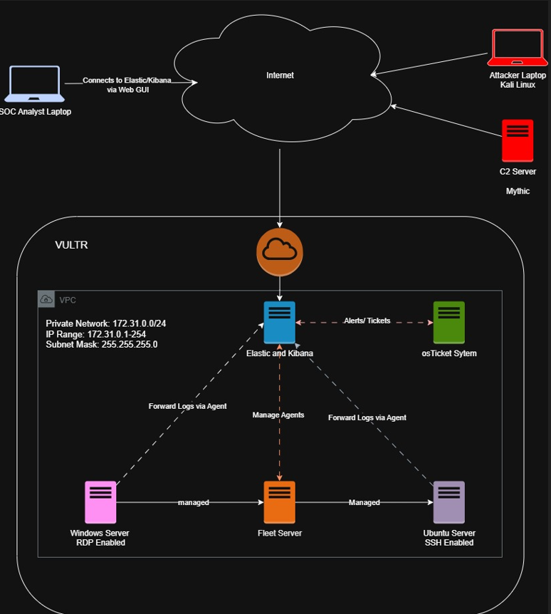

# Day 1 — SOC Lab Network Architecture

## Overview

* Cloud-based SOC lab hosted on **VULTR**.
* Private VPC simulates a small production network for SOC training.
* Purpose: centralize log collection, monitoring, alerting, and ticketing.

### Network Diagram
Accessing Draw.io

   * Open [draw.io](https://app.diagrams.net/).
   * Explore basic tools: Shapes (General Tab), Grid, Background, Styles.
   * Creating the Network Diagram



# Cloud Provider: Vultr (Hosting all virtual machines).
   * Servers & Computers in the Setup:
   * Elastic & Kibana Server
   * Windows Server (RDP enabled)
   * Ubuntu Server (SSH enabled)
   * Fleet Server
   * OS Ticket Server
   * C2 (Command & Control) Server (Marked in Red)
   * SOC Analyst Laptop
   * Attacker Laptop (Marked in Red)


## Network configuration

```
Private Network CIDR: 172.31.0.0/24
IP Range: 172.31.0.1 - 172.31.0.254
Subnet Mask: 255.255.255.0
Cloud Provider: VULTR
```

## Components & roles

1. **Elastic & Kibana (Central SIEM)**

   * Indexes and visualizes logs.
   * Hosts Kibana Web GUI for analysts.
   * Generates alerts and forwards them to osTicket.

2. **Fleet Server (Agent manager)**

   * Manages Elastic Agents on endpoints.
   * Central point for secure agent communication and policy distribution.
   * Forwards agent logs to Elastic.

3. **Windows Server (Endpoint)**

   * RDP enabled for admin access.
   * Elastic Agent installed to forward Windows logs (Event Log, Sysmon, etc.).

4. **Ubuntu Server (Endpoint)**

   * SSH enabled for admin access.
   * Elastic Agent installed to forward Linux logs (syslog, auth, etc.).

5. **osTicket (Alert / Incident Management)**

   * Receives automated alerts or tickets from Elastic/Kibana.
   * Tracks incident lifecycle and analyst actions.

6. **Analyst Workstation**

   * Connects to Kibana Web GUI over the internet for monitoring and investigation.

## Data flow (high level)

* `Endpoint Agents (Windows/Ubuntu)` → forward logs → `Fleet Server`
* `Fleet Server` → forwards/manage → `Elastic & Kibana`
* `Elastic & Kibana` → alerting → `osTicket` (tickets/alerts)
* `Analyst Workstation` → accesses → `Kibana Web GUI`

## Purpose / Use cases

* Centralized monitoring of endpoint and system logs.
* Hands-on SOC tasks: alert triage, investigation, and ticket management.
* Practice configuring and managing Elastic Agents and Fleet.
* Validate alert-to-ticket automation with osTicket.

## Quick setup checklist

* [ ] Create VPC on VULTR and deploy VMs in `172.31.0.0/24`.
* [ ] Deploy Elasticsearch + Kibana and open Kibana web UI.
* [ ] Install and configure Fleet Server.
* [ ] Enroll Elastic Agents on Windows and Ubuntu endpoints.
* [ ] Create/integrate alerting rules in Kibana.
* [ ] Configure outgoing alert actions to osTicket (API or email).
* [ ] Test: generate logs on endpoints → verify ingestion → trigger alert → ticket creation.
* [ ] Harden access: restrict management ports, enable strong credentials.

## Notes / best practices

* Keep Fleet-to-agent communication secured (TLS).
* Store backups of Elasticsearch indices or snapshots.
* Limit public exposure of management interfaces; use VPN or restricted IP allow-lists.
* Log retention and index lifecycle policies should be planned as the lab grows.

---
