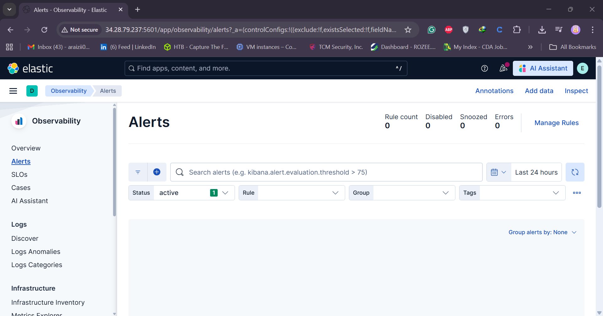

## 🧠 **Day 4: Setting Up Kibana**

### 🎯 Objective

Install, configure, and access **Kibana** on a cloud-hosted **Ubuntu ELK VM** so you can visualize and manage Elasticsearch data for your SOC lab.

---

### 🧩 **Steps Followed**

#### **1. Download and Install Kibana**

Visit the Elastic downloads page for Kibana and copy the `.deb` link. Then run:

```bash
wget https://artifacts.elastic.co/downloads/kibana/kibana-9.1.5-amd64.deb
sudo dpkg -i kibana-9.1.5-amd64.deb
```

✅ _Kibana is installed under `/usr/share/kibana` and the kibana service unit is created._

---

#### **2. Configure Kibana**

Open and edit the main configuration file:

```bash
sudo nano /etc/kibana/kibana.yml
```

Update these values (use your VM’s private IP):

```yaml
server.port: 5601
server.host: "0.0.0.0" # Replace with your VM private IP
```

Save (`CTRL+X`, `Y`, `ENTER`).

---

#### **3. Enable and Start the Kibana Service**

```bash
sudo systemctl daemon-reload
sudo systemctl enable kibana.service
sudo systemctl start kibana.service
sudo systemctl status kibana.service
```

✅ The `status` output should show **active (running)**.

---

#### **4. Generate Kibana Enrollment Token**

Generate a token so Kibana can securely enroll with Elasticsearch:

```bash
cd /usr/share/elasticsearch/bin
sudo ./elasticsearch-create-enrollment-token --scope kibana
```

Copy the token (starts with `eyJ...`) — you will paste this into the Kibana web UI.

---

#### **5. Open Firewall Port (5601)**

**On the Ubuntu VM:**

```bash
sudo ufw allow 5601/tcp
sudo ufw reload
```

**On the cloud provider (GCP/Vultr) firewall:**

Create/modify a firewall rule that allows inbound `tcp:5601` to your `elk-vm`. Example fields:

- **Name:** `allow-kibana`
- **Targets:** `elk-vm` (or tag)
- **Source IP ranges:** `YOUR_PUBLIC_IP/32` (or `0.0.0.0/0` for testing)
- **Protocols and ports:** `tcp:5601`

> Tip: For production, restrict Source IP to only your management IP.

---

#### **6. Access Kibana from Browser**

Open:

```
http://<YOUR_EXTERNAL_VM_IP>:5601
```

Example:

```
http://34.28.79.237:5601
```

You should see the **Kibana Enrollment** page.

---

#### **7. Connect Kibana to Elasticsearch**

- Paste the **enrollment token** you generated earlier and click **Configure Elastic**.
- If prompted for a verification code, run in the Kibana bin folder:

```bash
cd /usr/share/kibana/bin
sudo ./kibana-verification-code
```

Copy the 6-digit code and paste it into the browser verification prompt.

---

#### **8. Log in to Kibana**

Use the `elastic` superuser credentials produced by the Elasticsearch setup:

```
Username: elastic
Password: (the auto-generated password shown during Elasticsearch installation)
```

If you lost it, reset the password:

```bash
sudo /usr/share/elasticsearch/bin/elasticsearch-reset-password -u elastic
```

---

#### **9. (Optional) Add Encryption Keys**

To persist Kibana saved objects and remove the "API integration key required" warning, generate and configure encryption keys:

```bash
cd /usr/share/kibana/bin
sudo ./kibana-encryption-keys generate
```

The command prints three keys, for example:

```text
xpack.encryptedSavedObjects.encryptionKey: da019d88...
xpack.reporting.encryptionKey: 84e0ca54...
xpack.security.encryptionKey: 4986f661...
```

Add them to `/etc/kibana/kibana.yml` (or use the keystore):

```yaml
xpack.encryptedSavedObjects.encryptionKey: "<key1>"
xpack.reporting.encryptionKey: "<key2>"
xpack.security.encryptionKey: "<key3>"
```

Then restart Kibana:

```bash
sudo systemctl restart kibana
```

---

### ✅ Verification

1. Visit `http://<YOUR_EXTERNAL_VM_IP>:5601` in a browser.
2. Paste the enrollment token and follow the verify steps.
3. Log in using the `elastic` user.
4. Click **Explore on my own** — Kibana dashboard should load.

---

### 🧾 Key Takeaways

- Kibana installed and configured to run on port **5601**.
- Kibana successfully enrolled to Elasticsearch using the enrollment token.
- Firewall rules (cloud + VM) must allow inbound `tcp:5601`.
- Optional encryption keys secure saved objects, reporting, and sessions.

---


