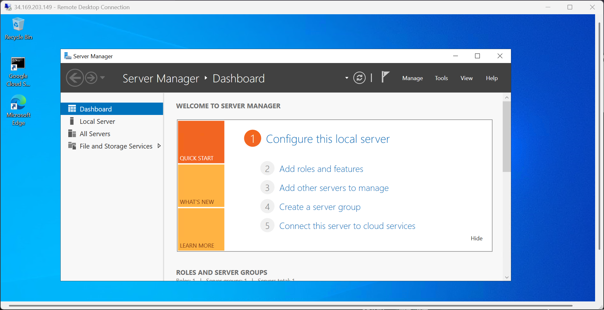

# 🧠 **Day 5: Setting Up Windows Server (Target Machine)**

### 🎯 **Objective**

Deploy and configure a **Windows Server 2022** instance on **Vultr Cloud** that will act as the **target machine** for your SOC (Security Operations Center) lab.  
By the end of this setup, you’ll have a **Windows Server** with **RDP (Remote Desktop Protocol)** exposed to the internet — ready to generate real-world security logs.

---

## 🧩 **Steps Followed**

### **1. Log in to Vultr**

- Navigate to [Vultr Cloud Console](https://www.vultr.com/).
- Log in with your account credentials.
- Click **Deploy** → **Deploy New Server**.

---

### **2. Configure Server Settings**

#### **a. Server Type**

- Select: **Cloud Compute (Shared CPU)**  
  _(Lightweight and cost-effective — perfect for this lab.)_

#### **b. Server Location**

- Choose the same region as your other SOC machines (e.g., **Toronto**).

#### **c. Operating System Image**

- Select: **Windows Standard**
- Version: **Windows Server 2022 (Latest)**

#### **d. Server Size**

- Choose the cheapest plan:  
  `1 vCPU / 2 GB Memory — $24/month`

#### **e. Additional Options**

- Disable **Auto Backups**
- Disable **IPv6**
- **Do NOT** attach this server to your existing VPC

---

### **3. Network Isolation Design**

To protect the rest of your SOC environment:

- Keep **ElasticSearch**, **Kibana**, **Fleet Server**, and **OS Ticket** within a **private VPC**.
- Deploy the **Windows Server** and **Ubuntu Server** **outside** of the VPC.  
  This ensures that if one of them is compromised, it won’t affect the rest of your network.

📊 **Updated Network Diagram Overview**
