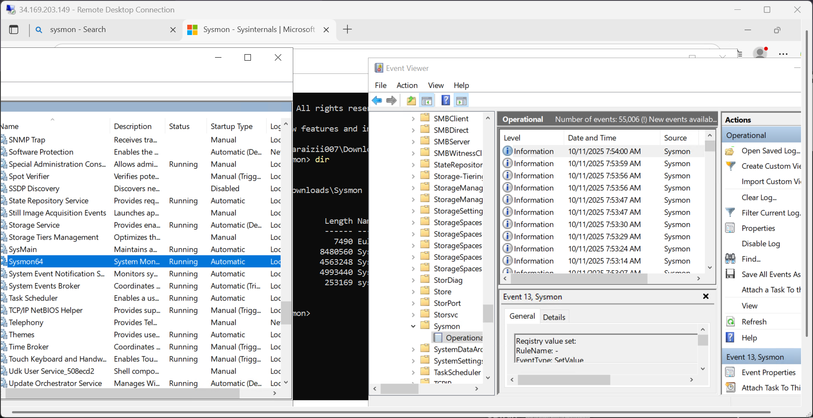

# 🧠 Day 9 — Sysmon Installation and Configuration on Windows Server

Welcome to **Day 9** of the **30-Day MyDFIR for SOC Analyst Challenge**!  
This challenge is designed to help aspiring SOC Analysts gain **hands-on practical experience** in just 30 days.

By the end of this lesson, you will:

- Install **Sysmon** on your Windows Server (created in Day 5).
- Configure Sysmon using **Olaf’s Sysmon configuration file**.
- Confirm that your server is successfully generating **Sysmon event logs**.

---

## 🚀 Objective

In this lab, we’ll focus on installing and configuring **Sysmon** — one of the most powerful Windows monitoring tools that captures detailed system activity, including process creation, network connections, and file changes.

Sysmon is part of **Microsoft Sysinternals Suite**, and its data is invaluable for **incident detection and forensic analysis** in SOC environments.

---

## 🧩 Step 1: Download Sysmon

1. Open your browser and **Google “Sysmon”**.
2. Click the first result:  
   👉 [Microsoft Learn - Sysmon (Sysinternals)](https://learn.microsoft.com/en-us/sysinternals/downloads/sysmon)
3. At the time of recording, the version is **15.15**, though you may find a newer version when you follow along.
4. Click **Download Sysmon**.

> 💡 Note: On the same page, scroll down to explore the **different Event IDs** Sysmon generates — these are crucial for log analysis.

---

## 🧩 Step 2: Connect to Your Windows Server

1. Log into your **Windows Server** created on Day 5 using **RDP** (Remote Desktop).
2. Use your server’s **public IP address**, username (`Administrator`), and password from your provider (e.g., Vultr).

Example:

```
IP Address: 149.248.59.41
Username: Administrator
Password: (your server password)
```

> 💡 You can use the console directly, but RDP provides a more convenient interface.

---

## 🧩 Step 3: Extract Sysmon Files

1. Once downloaded, go to your **Downloads folder**.
2. Right-click on the Sysmon ZIP file → **Extract All**.
3. Inside, you’ll find **three binaries**:
   - `Sysmon.exe`
   - `Sysmon64.exe`
   - `Sysmon64a.exe`

Keep this folder open — we’ll need it shortly.

---

## 🧩 Step 4: Download Sysmon Configuration File

To get meaningful logs, Sysmon needs a **configuration file** that defines what events to monitor.

We’ll use **Olaf Hartong’s Sysmon configuration**, a widely trusted config in the cybersecurity community.

1. Google **“Sysmon Olaf configuration GitHub”**.
2. Click the GitHub repository link (by Olaf Hartong).
3. Scroll down and find **sysmonconfig.xml**.
4. Click **Raw**, then **Right-click → Save As**.
5. Save the file into your **Sysmon directory** and keep the name `sysmonconfig.xml`.

---

## 🧩 Step 5: Install Sysmon

Now that we have both Sysmon and the configuration file, let’s install it.

1. Open **PowerShell as Administrator**:
   - Search “PowerShell”
   - Right-click → “Run as Administrator”
2. Navigate to the Sysmon directory:

```powershell
cd "C:\Users\Administrator\Downloads\Sysmon"
```

3. Verify the contents:

```powershell
dir
```

You should see `sysmon64.exe` and `sysmonconfig.xml`.

4. Before installing, let’s confirm Sysmon isn’t already running:
   - Open **Services** (`services.msc`)
   - Search for `Sysmon` — it shouldn’t be listed yet.
   - Open **Event Viewer** → `Applications and Services Logs → Microsoft → Windows`
   - No Sysmon folder will appear here yet.

---

## 🧩 Step 6: Run the Sysmon Installation Command

In your PowerShell window, execute:

```powershell
.\Sysmon64.exe -i sysmonconfig.xml
```

Then, accept the **license agreement**.

This installs Sysmon as a **Windows service** and begins monitoring based on your configuration file.

---

## 🧩 Step 7: Verify Sysmon Installation

After installation:

1. Open **Services** again and click **Refresh**.  
   You should now see:
   ```
   Sysmon64 — Running
   ```
2. Open **Event Viewer** again:
   - Expand:  
     `Applications and Services Logs → Microsoft → Windows → Sysmon`
   - Click **Operational**

You should start seeing event logs such as:

```
Event ID 3 — Network Connection Detected
```

> 🔍 **Reference**: In the Sysmon documentation, Event ID 3 represents **network connection events**.



---

## 🧠 Understanding Sysmon Event IDs

Sysmon logs a variety of events including:
| Event ID | Description |
|-----------|--------------|
| 1 | Process Creation |
| 3 | Network Connection |
| 7 | Image Loaded |
| 11 | File Created |
| 13 | Registry Value Set |
| 22 | DNS Query |

These events are extremely useful for detecting malware, lateral movement, and suspicious process activity.

---

## 🧰 Troubleshooting Tips

- **Sysmon not appearing in Event Viewer:**  
  Restart Event Viewer or your machine. Sometimes logs need a moment to register.

- **Configuration errors:**  
  Ensure the XML file name matches exactly (`sysmonconfig.xml`) and is in the same directory as `Sysmon64.exe`.

- **Reconfigure Sysmon:**  
  If you modify your config file, run:
  ```powershell
  .\Sysmon64.exe -c sysmonconfig.xml
  ```
  This updates the configuration without reinstalling.

---
