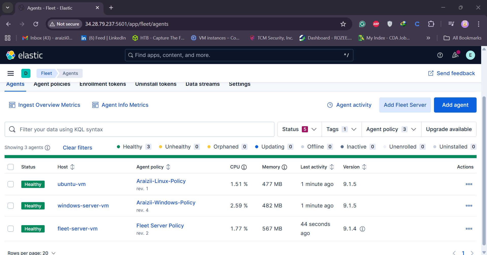

# Day 13 — Install Elastic Agent & Ingest SSH Logs (SOC Analyst Challenge)

[](./) [](./)

---

## Overview

This single-file markdown contains a complete, GitHub-ready guide for **Day 13**: installing the Elastic Agent on the SSH server you created on Day 12 and ingesting authentication logs into your Elasticsearch instance (via Kibana Fleet). Everything below is in one section so it displays cleanly in a `.md` file.

**Goal:** Enroll your Linux SSH host into Fleet, apply a policy that ships `/var/log/auth.log` (or `/var/log/secure` on RHEL/CentOS), confirm incoming data in Kibana Discover, and show quick tips for exploring events.

---

## Table of Contents

1. [Prerequisites](#prerequisites)
2. [Create an Agent Policy in Kibana Fleet](#create-an-agent-policy-in-kibana-fleet)
3. [Select integrations & supported log paths](#select-integrations--supported-log-paths)
4. [Enroll the agent on your Linux host (example)](#enroll-the-agent-on-your-linux-host-example)
5. [Troubleshooting enrollment (self-signed certs)](#troubleshooting-enrollment-self-signed-certs)
6. [Verify agent & incoming data in Kibana](#verify-agent--incoming-data-in-kibana)
7. [Explore logs in Discover — quick tips](#explore-logs-in-discover----quick-tips)
8. [Service checks & logs on the host](#service-checks--logs-on-the-host)
9. [Conclusion & next steps]
10. [Safety & ethics]

---



## Prerequisites

* Kibana + Elasticsearch accessible (Fleet enabled).
* Admin privileges in Kibana to create agent policies and enroll agents.
* A Linux SSH server (from Day 12) with root or sudo access.
* If using self-signed certificates on your Fleet server, be prepared to use `--insecure` during enrollment.

---

## Create an Agent Policy in Kibana Fleet

1. Open Kibana and click the hamburger menu (top-left) → **Management** → **Fleet**.
2. Go to **Agent policies** and click **Create agent policy**.
3. Give it a descriptive name (example: `Araizii-Linux-Policy`) and click **Create agent policy**.

This policy will be used to control which integrations and data streams the agent ships to Elasticsearch.

---

## Select integrations & supported log paths

1. Inside the newly created policy, click **Add integration** (or use the existing `system` integration).
2. Select **System** (or `system-3` if present) to collect system logs and auth logs.
3. Check the integration settings to confirm it is configured to capture authentication logs. Typical paths:

   * Ubuntu/Debian: `/var/log/auth.log`
   * Red Hat/CentOS: `/var/log/secure`

> The system integration usually has options per OS so it covers `/var/log/auth.log` for Debian/Ubuntu and `/var/log/secure` for RHEL/CentOS.

---

## Enroll the agent on your Linux host (example)

1. In Fleet, click **Agents** → **Add agent**.
2. Choose the agent policy you created (`mydfir-linux-dp-policy`) and select **Enroll in Fleet**.
3. Pick **Linux** as the OS and copy the enroll command shown by Kibana.

**Example (placeholder)**

```bash
# This is a sample; copy the exact command from Kibana Fleet.
# The command typically downloads and runs the installer and enrolls the agent.
sudo /bin/bash -c "\
  elastic-agent install \
  --url=https://<KIBANA_HOST>:8220 \
  --enrollment-token=<ENROLLMENT_TOKEN> \
  --insecure\
"
```

* Replace `<KIBANA_HOST>` and `<ENROLLMENT_TOKEN>` with values provided in Fleet.
* If your Fleet server uses a self-signed certificate, include `--insecure` (see troubleshooting below).

---

## Troubleshooting enrollment (self-signed certs)

If you receive an error like `x509: certificate signed by unknown authority` or `failed to execute request to Fleet server`, add the `--insecure` flag to the installer command to bypass certificate verification for testing (only do this in lab/dev environments).

**Example:**

```bash
# Add --insecure when prompted if using self-signed cert.
elastic-agent install --url=https://kibana.example.com:8220 --enrollment-token=ABCDEF --insecure
```

After successful enrollment you should see confirmation both in your terminal and in Kibana Fleet.

---

## Verify agent & incoming data in Kibana

1. In Fleet → **Agents**, you should see the newly enrolled agent with status **Online**.
2. Click the agent to view its details — it should show the assigned policy (`Araizii-Linux-Policy`) and installed integrations.
3. Confirm **Incoming data** / **Events** are being reported. Fleet usually shows a green indicator when events are received.

### Check Discover for events

1. Open **Discover** from the Kibana menu.
2. Remove any pre-set filters (e.g., `winlog.event_id`) and create a filter for your agent by **agent.name** (or `host.name`) to narrow results to your Linux host.
3. Use search terms such as `message: "pam_unix(sshd:auth): authentication failure"` or `authentication failure` to find SSH auth failures.

You can increase the `rows per page` (e.g., to 500) in the Discover UI to show many events on one page.

---

## Explore logs in Discover — quick tips

* Add the `message` field (click its field name → click the column toggle icon) to include the full log message in the table view.
* Use the discover filter bar to add filters like: `agent.name : "Araizii-linux-*"` or `source.ip : "203.0.113.45"`.
* Try queries to locate authentication issues:

  * `event.dataset: "system.auth"` or similar system dataset names (depends on integration).
  * `message: "authentication failure" OR message: "Failed password"`
* Use `Inspect` → `View: Raw` on an event to see the original parsed fields.

---

## Service checks & logs on the host

On the Linux server you can confirm the agent service status and view its logs:

```bash
# Check service status
sudo systemctl status elastic-agent

# Follow agent logs (live)
sudo journalctl -u elastic-agent -f

# Ensure data files exist (optional)
ls -la /opt/Elastic/Agent
```

If the agent fails to start, the journal logs usually include helpful error messages about enrollment, certificate issues, or file permissions.

---

## Example: correlate an IP from the host to Kibana

If you identified a suspicious IP on the host via `grep`/`awk` against `/var/log/auth.log`, copy that IP and paste it into Kibana Discover filter `source.ip : "<IP>"` or search the `message` field for that IP. You should be able to find all recorded events from that IP across the indexed time range.

---

## Conclusion & next steps

* You have installed and enrolled the Elastic Agent on your SSH host and confirmed logs are flowing into Elasticsearch.
* Next video: create alert rules for brute-force detection and build a dashboard that visualizes top attacker IPs, geolocation, and failed vs successful auth trends.

---

## Safety & ethics

Only install agents and collect logs from systems you own or are authorized to manage. When testing with self-signed certificates, use `--insecure` only in lab environments — never in production.

---

