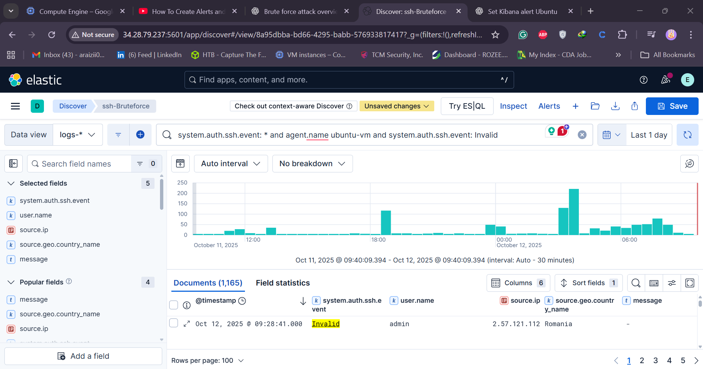
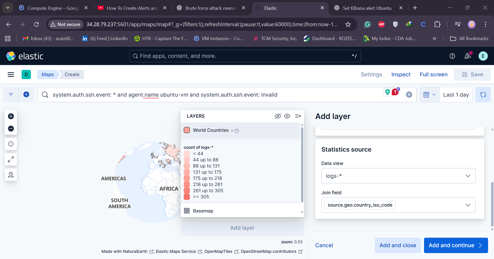
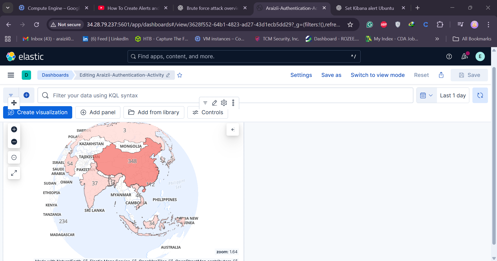
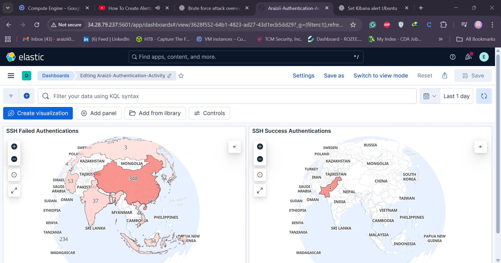

# 🚨 Day 14 — SSH Brute Force Alert & Dashboard (SOC Analyst Challenge)

Welcome to **Day 14** of the **30-Day MyDFIR for SOC Analyst Challenge**! 🎯
In this session, we’ll build an **SSH Brute Force Alert** and an **interactive dashboard** in **Kibana** to visualize attack sources in real-time.

---

## 🧩 Objective

By the end of this lab, you will:

* Understand what an SSH brute-force attack looks like in logs.
* Query and filter SSH authentication events in **Kibana Discover**.
* Create an **alert rule** for SSH brute-force activity.
* Build an **SSH Attack Map Dashboard** to visualize attack origins.

---

## 🔍 Step 1: Review SSH Authentication Logs

Before we build an alert, we need to analyze SSH authentication logs already ingested into **Elasticsearch**.

1. Open **Kibana → Discover**.
2. Select your SSH data source (e.g., `ariazii-linux-distro`).
3. Verify that logs from `/var/log/auth.log` are being ingested.
4. Set the **time range** to *Today* to review recent activity.

Look for authentication attempts in your logs — specifically the following key fields:

* **system.auth.ssh.event** — Indicates SSH events such as `failed`, `invalid`, or `accepted`.
* **user.name** — Shows the attempted username.
* **source.ip** — IP address from which the attempt originated.
* **source.geo.country_name** — Country name for geographic visualization.

---

## 🧠 Step 2: Identify Brute Force Indicators

A brute-force attack is characterized by repeated **failed authentication attempts**.
Let’s extract these key indicators:

1. In **Discover**, search for SSH event field:

   ```kql
   system.auth.ssh.event : *
   ```
2. Filter the data for failed attempts only:

   ```kql
   system.auth.ssh.event : "failed"
   ```
3. Add columns for visualization:

   * `user.name`
   * `source.ip`
   * `source.geo.country_name`

Now you can see which users are being targeted and where the attacks are coming from. 🌍

> 💡 **Tip:** Highlight the word `failed` in the message field and click the ➕ icon to auto-filter failed login attempts.

---

## 🧾 Step 3: Save Your Query

Once your query is ready:

1. Click **Save Search** (top-right corner).
2. Name it something descriptive, e.g.:

   ```text
   SSH Failed Activity
   ```
3. This saved search will later be reused in our alert and dashboard.

---

## ⚙️ Step 4: Create the SSH Brute Force Alert

Now, let’s create a **Threshold Rule** for brute-force activity:

1. Go to **Alerts → Create Rule → Threshold Rule**.
2. Name your alert (include your handle for tracking):

   ```text
   mydf-ssh-bruteforce-activity-syedsaifali
   ```
3. Use your saved query — it will auto-populate in the rule.
4. Configure the threshold condition:

   * **WHEN**: count of documents is **above 5**
   * **FOR THE LAST**: 5 minutes
   * **AGAINST**: system.auth.ssh.event : "failed"
5. Test the query:

   ```
   Matched 749 documents in the last 5 days
   ```
6. Set the **check interval** to `1 minute`.
7. Save the rule.

✅ **Result:** You now have a working alert that triggers whenever 5+ failed SSH attempts occur within 5 minutes.

> ⚠️ Note: In production, fine-tune thresholds to reduce false positives.

---



## 🗺️ Step 5: Build SSH Attack Dashboard

Now let’s visualize where these SSH brute-force attempts are coming from.

### 1. Open Kibana Maps

* Go to **Analytics → Maps**.
* Create a new map and paste your saved query:

  ```kql
  agent.name : "mydf-linux-distro" and system.auth.ssh.event : "failed"
  ```

### 2. Add a Layer

* Click **Add Layer → Choropleth Layer**.
* Select **EMS Boundaries → World Countries**.
* Join field: `iso_3166_1_alpha2` (country ISO code).
* Metric Source: your active data view.
* Field: `source.geo.country_iso_code`

### 3. Customize Map

* Name the layer: `SSH Failed Authentications`.
* Adjust visualization (opacity, color, etc.) as desired.
* Click **Save → Add to New Dashboard**.

### 4. Save Dashboard

Name it:

```text
SSH Failed Authentication Activity Map
```

You can now visually track SSH attack sources — e.g. multiple failed attempts from **China**, **Japan**, or **South Korea**.

---




## 🧮 Step 6: Add Successful Authentication Visualization

You can also monitor successful SSH authentications:

1. Duplicate the dashboard panel.
2. Change the query to:

   ```kql
   system.auth.ssh.event : "accepted"
   ```
3. Save as `SSH Successful Authentication`.

Now you can compare failed vs successful login activity.

---

## 🎯 Step 7: Final Dashboard Overview

✅ **SSH Failed Authentications** — Visual map showing failed login attempts by country.
✅ **SSH Successful Logins** — Track authorized SSH access.
✅ **Alert Rule** — Monitors and triggers notifications for brute-force activity.

---


## 🧩 Conclusion

Congratulations! 🎉 You’ve successfully:

* Created an **SSH Brute Force Detection Alert** in Kibana.
* Built a **visual dashboard** to pinpoint attacker geolocations.

You now have both **real-time detection** and **geographic context** for SSH brute-force attacks — essential capabilities for any SOC Analyst.

---

## 🧰 Tools Used

* **Elastic Stack (Kibana, Elasticsearch, Fleet, Agent)**
* **Ubuntu SSH Server Logs (`/var/log/auth.log`)**
* **GeoIP Enrichment** for source location

---

