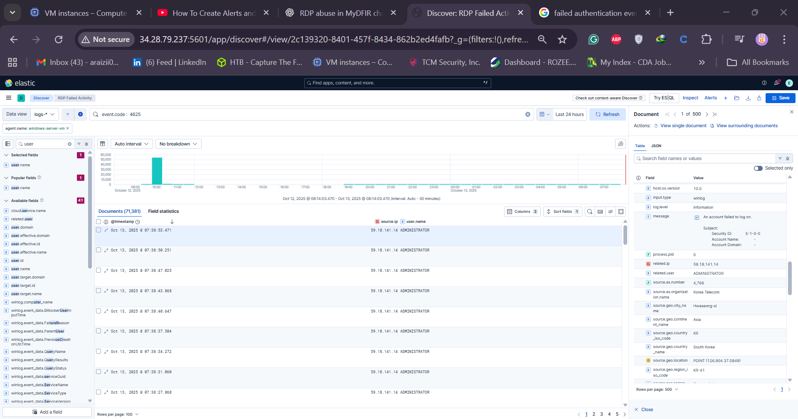
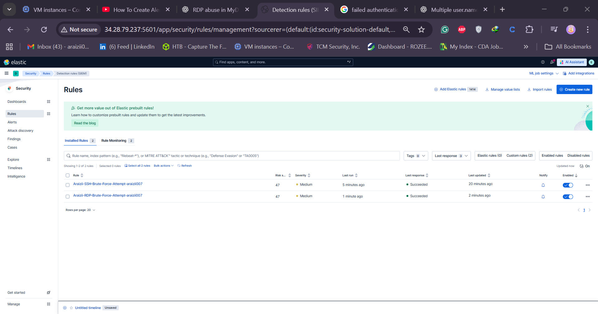

# Day 16 — Windows Authentication Logs & RDP Brute‑Force Alerts

> Part of the **30‑Day MyDFIR for SOC Analyst Challenge** — Day 16

---

## Overview

In this lesson we review Windows authentication logs from our cloud lab (the Windows server created on Day 5), create a brute‑force detection for Windows RDP/Network logons, and compare different alerting approaches in Elastic: Discover‑based threshold alerts vs Security Detection Rules.

**Goals:**

* Identify the correct Windows Event IDs and fields for failed and successful authentication.
* Build and save a Discover query for failed RDP/network authentication (event.code `4625`).
* Create a Search Threshold alert and a Security Detection (Threshold) rule that groups by user and source IP and provides richer alert context.
* Test by generating failed logons and inspect alert details.

---



## Key Windows event IDs & fields

* **4625** — An account failed to log on (use this for failed authentication detection).
* **4624** — An account was successfully logged on (use this to detect successful RDP logons).

Important fields commonly used in detection & triage:

* `event.code` (e.g., `4625`, `4624`)
* `user.name` (the account that attempted the login)
* `source.ip` / `Source Network Address` (originating IP)
* `message` (human readable description; contains logon type)
* Logon types to be aware of:

  * **Type 3** — Network logon (often used for network authentication attempts — can be SMB, RDP network auth, etc.)
  * **Type 10** — RemoteInteractive (true RDP interactive session)
  * **Type 7** — Unlock (sometimes seen in remote sessions)

---

## Demo — build a Discover query and save it

1. Open **Kibana** → **Discover**.
2. Set a time range (e.g., `Today` or `Last 5 minutes`) to focus on recent auth activity.
3. Narrow to your target agent using `agent.name` (for example: `araizii-win-steppenrocks`).
4. Search for failed logons by entering `4625` in the Discover search bar, then inspect an event to find the exact field path (e.g., `event.code`).
5. Update the query to be explicit: `event.code:4625` and hit **Update** — you should see the failed auth events.
6. Add columns: `source.ip` and `user.name` to the Discover table so the failed username and origin IP are visible.
7. Verify an event: expand a record and confirm the `message` shows `An account failed to log on` and lists the `Source Network Address` and username.
8. Save the search as `RDP failed Activity` (or another meaningful name) for reuse and alert creation.

**Tip:** A network based failed auth may be logon type 3. To confirm RDP is involved, test a failed RDP login and re‑check Discover — a new `4625` with `logon_type: 3` and matching `source.ip` should appear.

---

## Create a quick Search Threshold alert (Discover → Alerts)

This is the quick method used for basic alerting but note it provides **limited context** in the alert payload.

1. In Discover, click **Alerts** → **Create search threshold rule**.
2. Use your saved search (or `event.code:4625` query) as the source.
3. Configure threshold: e.g., **Count > 5** for the last **5 minutes** (tune to your environment).
4. Schedule: check every 1 minute (or desired cadence).
5. Save the rule.

**Result:** This will raise alerts when the threshold is crossed, but the alert details are minimal (limited fields shown in Discover alert view).

---

## Create a Security Detection (Threshold) rule — richer alert context

To get more actionable alerts (including which username and source IP triggered the rule), use the Security → Detection Rules UI and choose a Threshold rule. This provides grouping and highlighted fields in the alert details, improving triage.

1. Go to **Security** → **Detection Rules** → **Create new rule**.
2. Choose **Rule type: Threshold**.
3. Index pattern: keep default or point to your Windows event index (e.g., `winlogbeat-*` / `logs-*`).
4. Custom query: paste the `event.code:4625` query and refine if needed (e.g., `agent.name:"araizii-win-steppenrocks" AND event.code:4625`).
5. Group by: `source.ip` and `user.name` (this tells the rule to count occurrences per user + source pair).
6. Threshold: `5` (trigger when count of events for the grouped fields exceeds 5 in the lookback window).
7. Required fields: add `source.ip` and `user.name` (these will appear as required highlighted fields in the alert output).
8. Name the rule (e.g., `araizii - RDP Brute Force Attempt — <your_handle>`), set severity (e.g., `medium`) and risk score as desired.
9. Schedule: Run every `1 minute`, look back `5 minutes` (adjust to taste).
10. Create and enable the rule.

**Why this is better:**

* The alert reason will include the username and source IP.
* The rule table view shows threshold fields and values so analysts can quickly see the offending pair.
* You can add an investigation and response guide to the rule to speed up analyst response.

---

## Testing the rules

* Generate failed logons from a known host (e.g., attempt an RDP login with a wrong password) and watch Discover.
* The Search Threshold alert should fire when the configured count is reached.
* The Security Detection rule will produce richer alerts — click **View alert details** → **Table** to see `source.ip`, `user.name`, and threshold counts.
* If you have an EDR and Enterprise features, `Visualizations` and `Insights` will show additional host/context (note: some features may require a license).

---

## Example queries (copy/paste)

* Basic failed auth: `event.code:4625`
* Failures for a specific host: `agent.name:"araizii-win-steppenrocks" AND event.code:4625`
* Failures for specific user: `event.code:4625 AND user.name:administrator`
* Successful RDP interactive logon: `event.code:4624 AND logon.type:10`

---

## Investigation & triage suggestions

When an alert fires, investigate the following:

1. **Who** — `user.name` (is this a service account, admin, or regular user?)
2. **Where from** — `source.ip` (is it internal, external, known VPN exit, or suspicious country?)
3. **When** — check timestamps to see whether attempts are clustered and correlate with other events.
4. **How** — check `logon_type` in the event `message` to determine if it’s network (3) or remote interactive (10).
5. **Follow‑ups** — search for successful `4624` events after failed attempts, credential dumping indicators, unusual process execution, and lateral movement.

Quick containment if confirmed malicious:

* Block `source.ip` at the perimeter/firewall.
* Disable the affected account and force password rotation.
* Isolate the host for deeper forensic collection if signs of compromise exist.

---

## Tuning ideas & next steps

* Tune thresholds per account class (service accounts vs user accounts) and per environment noise level.
* Combine threshold detection with **indicator‑match** (blocklisted IPs) or **event correlation** (failed logons followed by privilege escalation events) to reduce false positives.
* Consider building an **ESQL** rule or using `new terms` to detect new source IPs/auth attempts at scale.
* Add an automation playbook for common responses (block IP, create ticket, gather logs) if you have SOAR/response integrations.

---



## Conclusion

Exposed authentication endpoints attract automated probing and brute‑force attempts. By understanding Windows auth events (`4625`, `4624`), creating saved searches, and using Security Detection threshold rules grouped by `source.ip` and `user.name`, you improve detection quality and alert context for faster triage and response.

On **Day 17** we will create a dashboard to visualize where authentication attempts originate and streamline analyst workflows.

---

## Quick checklist (copy/paste)

```
[ ] Save Discover search: RDP failed Activity (event.code:4625)
[ ] Add columns: source.ip, user.name
[ ] Create Search Threshold alert (basic) — Count > 5 in 5m
[ ] Create Security Detection Threshold rule — group by source.ip & user.name
[ ] Test by performing failed RDP logins from a controlled host
[ ] Tune thresholds and add any correlation or indicator-based enrichment
[ ] Plan dashboard for visualizing auth sources (Day 17)
```

---

