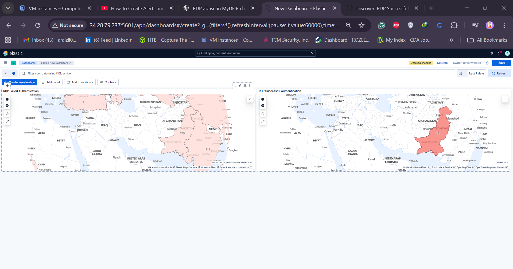
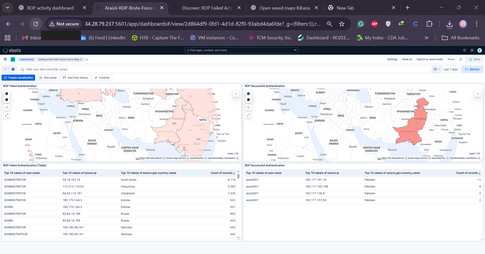

# 🧠 Day 17 — RDP Activity Dashboard in Kibana

Welcome to **Day 17** of the **30-Day MyDFIR for SOC Analyst Challenge**!  
In this session, we’ll create a **dashboard focusing on RDP activity** generated from the **Windows Server** you built back on **Day 5**.

---

## 🎯 Objective

Our goal is to build an **RDP activity dashboard** similar to the SSH activity map we created earlier, focusing on **failed and successful authentication attempts** from our Windows Server.

---

## 🧩 Step 1: Create the RDP Failed Authentication Map

1. Navigate to your **Elastic Web GUI**.
2. Click the **hamburger icon → Maps**.
3. Write the following query:
   ```
   event.code:4625 and agent.name:"mydfir-dwin-stevenrocks"
   ```
4. Set the **time range** to **Last 7 days** to ensure visibility of data.
5. Add a new layer:
   - Click **Add layer → Choropleth**.
   - Select **EMS Boundary → World Countries**.
   - For **Data view**, choose your alerts data source.
   - Join Field: `source.geo.country_iso_code`.
6. You’ll now see data points (e.g., 39,000 failed logins from Russia).  
   Save the map as **RDP Failed Authentication**.

---

## 📊 Step 2: Add RDP Failed Map to Dashboard

1. Go to **Dashboard → Add existing**.
2. Select your **SSH + Authentication Dashboard** (created earlier).
3. Add the **RDP Failed Authentication** visualization.
4. Save the dashboard — now you’ll have **SSH (top)** and **RDP (bottom)** activity maps.

---

## 🧠 Step 3: Create RDP Successful Authentication Map

1. Reference the **Windows Event ID 4624** (successful logon).
2. Look up the **logon types**:
   - **Type 10** → Remote interactive (RDP)
   - **Type 7** → Unlock
3. In **Discover**, modify the query:
   ```
   event.code:4624 and (winlog.event_data.LogonType:10 or winlog.event_data.LogonType:7)
   ```
4. Save the query as **RDP Successful Activity**.

---

## 🗺 Step 4: Duplicate for Successful Authentications

1. In your **dashboard**, duplicate the **RDP Failed Authentication** visualization.
2. Rename it to **RDP Successful Authentications**.
3. Update the query and title accordingly.
4. Save and confirm that successful RDP sessions appear (e.g., your own RDP session during Sysmon installation).

---



## 📋 Step 5: Add Data Tables to Dashboard

We’ll add tables for quick visibility of **Usernames**, **Source IPs**, and **Countries**.

### For Failed Activity

1. Go to **Discover → Search → event.code:4625**.
2. Add fields:
   - `@timestamp`
   - `source.ip`
   - `user.name`
   - `source.geo.country_name`
3. Save as **RDP Failed Activity**.

### For Successful Activity

1. Change event code to `4624`.
2. Apply the same fields.
3. Save as **RDP Successful Activity**.

### Visualize as Tables

1. Go to **Visualizations → Create new → Table**.
2. Insert saved searches for **RDP Failed** and **RDP Successful**.
3. Configure:
   - Show **Top 10 usernames** and **Top 10 IPs**.
   - **Uncheck “Group remaining values as other”**.
   - Sort by **Count → Descending**.
4. Save each as:

   - `RDP Failed Authentications (Table)`
   - `RDP Successful Authentications (Table)`

5. Add both to the main dashboard, alongside the maps.

---

## 🧾 Step 6: Final Dashboard Layout

Your dashboard should now include:

- SSH Failed Authentications (Map + Table)
- SSH Successful Authentications (Map + Table)
- RDP Failed Authentications (Map + Table)
- RDP Successful Authentications (Map + Table)

At a glance, you can now visualize:

- Username activity
- Source IPs
- Countries of origin
- Total failed/successful login attempts

---



## 💡 Notes

- Kibana may display warnings like “Top 10 values might be approximations.” This can be ignored for general insights.
- Ensure all visualizations are **saved** before exiting to avoid data loss.

---

## 🧠 Conclusion

By completing Day 17, you’ve learned how to:

- Query Windows RDP logs in Kibana.
- Visualize failed and successful authentications.
- Build an RDP activity dashboard with both maps and tables.

You should now have **two alerts** and **two dashboards** — one for SSH and one for RDP.  
In the next session, we’ll dive into **Command and Control (C2)** detection using the **Mythic Framework**.

---

### 🏁 Next Steps

Stay curious, build your own dashboards, and explore different log types.  
Each dataset reveals unique insights that strengthen your SOC analysis skills!

---

**Author:** Syed Saif Ali Shah  
**Challenge:** 30-Day araizii for SOC Analyst  
**Day 17: RDP Activity Dashboard**
