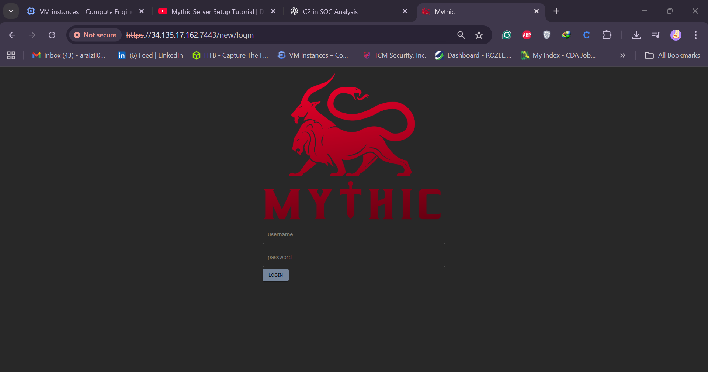
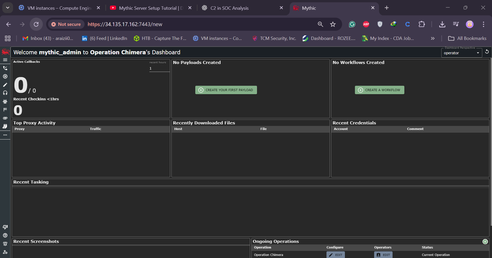

# Day 20 — Setting Up Mythic C2

Welcome to **Day 20** of the _30-Day MyDFIR for SOC Analyst Challenge_! This day focuses on setting up your own **Mythic Command and Control (C2)** instance and understanding how Mythic works. By the end, you’ll have a working Mythic setup ready for controlled red team and blue team simulations.

---

## 🧠 Objective

Set up and explore Mythic C2 framework, learn its architecture, and prepare it for integration with your attacker (Kali Linux) and target (Windows Server) environments.

---

## 🧰 Prerequisites

- A **Vultr Cloud** or similar cloud provider account.
- Basic understanding of Linux commands.
- Access to **Kali Linux** (as the attacker machine) — can be run in VMware or VirtualBox.

---

## ⚙️ Step 1: Deploy Mythic C2 Server

1. Log into your cloud provider (Vultr).
2. Click on **Deploy** → **Deploy New Server**.
3. Choose **Cloud Compute (Shared CPU)** and select **Toronto** as the region.
4. Choose **Ubuntu** OS with **4 GB RAM**.
5. Keep default settings, disable auto backups, and disable IPv6.
6. Set hostname: `mydfir-mythic`.
7. Click **Deploy Now**.

---

## 💻 Step 2: Setting Up Kali Linux VM

1. Go to [kali.org](https://www.kali.org) → **Download**.
2. Choose **Virtual Machine Image**.
3. Select your preferred hypervisor (VMware, VirtualBox, etc.).
4. Default credentials: `kali` / `kali`.
5. Extract the downloaded `.zip` file using 7-Zip.
6. Locate the `.vmx` file inside the extracted directory.
7. Double-click the `.vmx` file to import Kali into VMware Workstation.
8. Power on the Kali VM.

---

## 🔐 Step 3: Connect to Mythic Server

1. Go to Vultr → **Mythic Instance** → Click **View Console** to verify login prompt.
2. Open PowerShell and SSH into your Mythic VM:

```bash
   ssh root@<MYTHIC_IP>
```

3. Type `yes` when prompted and enter the root password from Vultr.

---

## 🧩 Step 4: Update Packages and Install Dependencies

Run the following commands to update and install necessary dependencies:

```bash
apt-get update && apt-get upgrade -y
apt-get install docker-compose make -y
```

---

## 🌀 Step 5: Clone and Install Mythic

```bash
git clone https://github.com/its-a-feature/Mythic.git
cd Mythic
./install_core_docker_ubuntu.sh
```

Once installed, start Mythic using:

```bash
make
```

If Docker isn’t running, start it manually:

```bash
systemctl restart docker
systemctl status docker
```

Run `make` again inside the Mythic directory to initialize Mythic.

---

## 🧠 Step 6: Start Mythic CLI

```bash
sudo ./mythic-cli start
```

This will launch Mythic and start all its required services.

---

## 🧱 Step 7: Secure Your Server

1. Return to Vultr dashboard → Click **Manage** → **Add Firewall Group**.
2. Name it: `mydfir-mythic-firewall`.
3. Add rules:

   - **Protocol:** TCP, **Ports:** 1–65535, **Source:** Your public IP.
   - Repeat for each machine that needs to connect (e.g., Windows target, Kali attacker).

4. Apply the firewall group to your Mythic instance.

---

## 🌐 Step 8: Access Mythic Web Interface

1. Copy your server’s public IP.
2. Visit it in your browser: `https://<MYTHIC_IP>:7443`
3. If you see the error _“plain HTTP request sent to HTTPS port”_, prepend **https://** manually.
4. You’ll see the Mythic login screen.

---



## 🔑 Step 9: Retrieve Mythic Credentials

To find your default username and password:

```bash
ls -la
cat .env
```

The username is usually `mythic_admin`. The password is in the `.env` file (unique per installation).

---

## 🧭 Step 10: Explore the Mythic Dashboard

Once logged in, Mythic provides a modern dashboard with:

- **Payloads** (C2 profiles, configurations)
- **Callbacks** (agent communications)
- **Tasks** (commands executed on infected hosts)
- **Files** (uploads/downloads)
- **Artifacts** (fingerprints, screenshots, keylogs)
- **MITRE ATT&CK Mapping** (techniques used)
- **Reports** (auto-generated reports and mappings)
- **Tags** (label and categorize operations)

You can also switch to **dark mode** by clicking the sun icon.

---



## 🚀 Step 11: Customize Operations

- Rename your default operation (`Operation Cima`) to something unique, e.g., `Operation MyDFIR`.
- Configure your payload profiles and create agents for your upcoming tests.

---

## 🧩 Conclusion

Today, you successfully deployed and configured your own **Mythic C2 server** — a powerful post-exploitation and red teaming framework. You also tightened its security with firewall rules and learned how to navigate its interface.

> ⚠️ Always use Mythic C2 responsibly — only in environments you own or have explicit permission to test.

```

```
