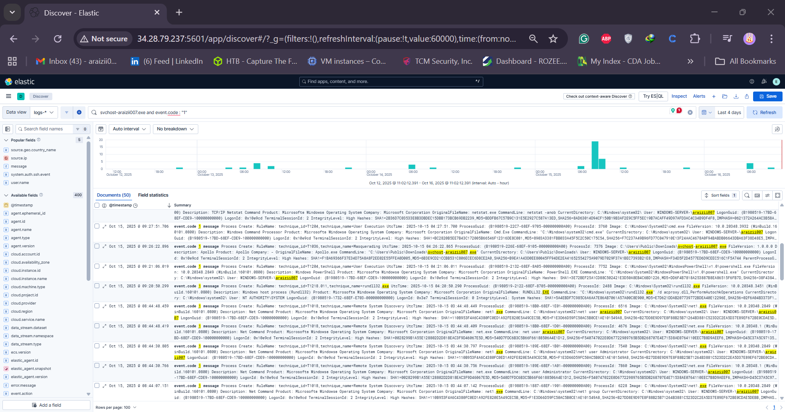
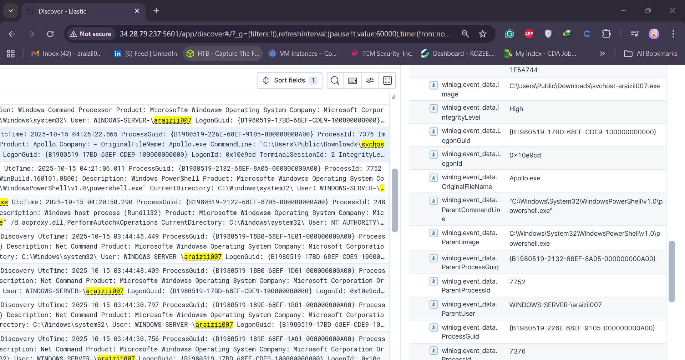
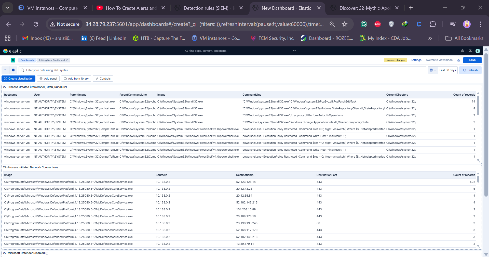

## Day 22 – Alert and Dashboard Setup (Araizii SOC Analyst Challenge)

Welcome to **Day 22** of the *30-Day Araizii SOC Analyst Challenge*, a challenge designed to help aspiring SOC analysts gain practical experience in 30 days.

If you haven’t followed along yet, it’s recommended to start from **Day 1**.  
By the end of this day, you’ll have:
- An **alert** that detects Mythic C2 activity (generated on Day 21)
- A **dashboard** to visualize suspicious activity

---

### 🧠 Objective
Detect and visualize Mythic C2 activity (Apollo agent) using Elastic Stack.

---

### 🧩 Step 1: Investigating Mythic C2 in Discover

1. Navigate to **Discover** in Elastic.
2. Set time range to **Last 30 days**.
3. Search for:
   ```
   servicehostdsten.exe
   ```
4. Sort results from **Old → New** to see initial activity.
5. Identify the **file creation event**:
   - **Event Code:** 11 (Sysmon File Created)
   - **Path:** `C:\Users\Public\Downloads\`
   - **Username:** Administrator
   - **Image:** PowerShell
   - **ProcessGuid:** (used for correlation)

6. Change query to find process creation:
   ```
   event.code:1
   ```
   This will show **process creation (Sysmon Event ID 1)** including hashes.

7. Copy the **SHA1** or **SHA256 hash** and check it on **VirusTotal** (likely undetected as it’s a newly generated Mythic agent).

8. Observe the field:
   ```
   winlog.event_data.OriginalFileName: apollo.exe
   ```
   This is the real executable name before being renamed.

---

### ⚙️ Step 2: Building a Detection Query

1. Query for both conditions:
   ```kql
   (winlog.event_data.hashes:*<SHA256_hash>* OR winlog.event_data.OriginalFileName:apollo.exe) AND event.code:1
   ```
2. Verify only one event appears.
3. Save this search as:
   ```
   Mythic Apollo Process Create
   ```

---

### 🚨 Step 3: Creating the Detection Rule

1. Go to **Security → Rules → Create new rule**.
2. Select **Custom Query** type.
3. Paste in your saved query.
4. Add **Required Fields**:
   - `@timestamp`
   - `winlog.event_data.User`
   - `winlog.event_data.ParentImage`
   - `winlog.event_data.ParentCommandLine`
   - `winlog.event_data.Image`
   - `winlog.event_data.CommandLine`
   - `winlog.event_data.ProcessGuid`
   - `winlog.event_data.CurrentDirectory`
5. Configure:
   - **Rule Name:** `Araizii - Mythic C2 Apollo Agent Detected`
   - **Description:** Detects potential Mythic C2 Apollo agent activity.
   - **Severity:** Critical
   - **Schedule:** Every 5 minutes (lookback: 5 minutes)
6. Click **Create & Enable Rule**.

   ```

---

### 📊 Step 4: Creating a Suspicious Activity Dashboard

We’ll visualize:
1. **Process Creation Events** (Event ID 1)
2. **External Network Connections** (Event ID 3)
3. **Windows Defender Disabled** (Event ID 50001)

#### 1️⃣ Powershell / CMD / rundll32 Executions
Query:
```kql
event.code:1 AND event.provider:"Microsoft-Windows-Sysmon" AND (powershell OR cmd OR rundll32)
```
Create a **Table Visualization** with columns:
- User
- Parent Image
- Parent Command Line
- Image
- Command Line
- Current Directory

Title it:
```
Process Created (PowerShell, CMD, rundll32)
```

#### 2️⃣ External Network Connections
Query:
```kql
event.code:3 AND event.provider:"Microsoft-Windows-Sysmon" AND winlog.event_data.Initiated:true
```
Table fields:
- Image
- Source IP
- Destination IP
- Destination Port

Exclude:
```kql
NOT winlog.event_data.Image:msmpeng.exe
```
Title:
```
Process Initiated Network Connections
```

#### 3️⃣ Defender Disabled
Query:
```kql
event.code:50001 AND event.provider:"Microsoft-Defender"
```
Table fields:
- Host Name
- Product Name
- Event Code

Title:
```
Microsoft Defender Disabled
```

---

### 🧾 Step 5: Dashboard Overview



You now have a 3-panel dashboard:
| Panel | Description |
|--------|--------------|
| **Process Created** | Detects suspicious PowerShell, CMD, or rundll32 executions |
| **Network Connections** | Shows outbound connections initiated by processes |
| **Defender Disabled** | Detects when Microsoft Defender is turned off |
   ```
---

### ✅ Summary

By completing Day 22, you have:
- Built an **Elastic Detection Rule** for Mythic C2 (Apollo agent)
- Created a **Dashboard** for quick visibility into suspicious activities
- Practiced **event correlation and alert logic** for real-world SOC workflows

---