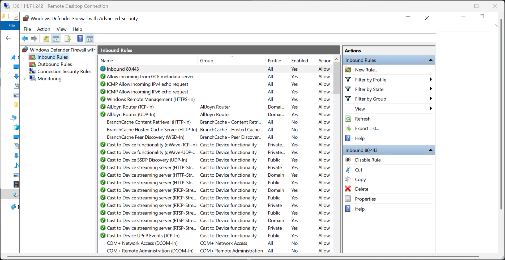
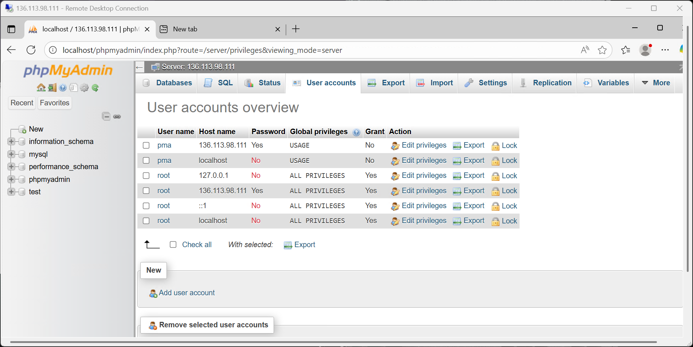
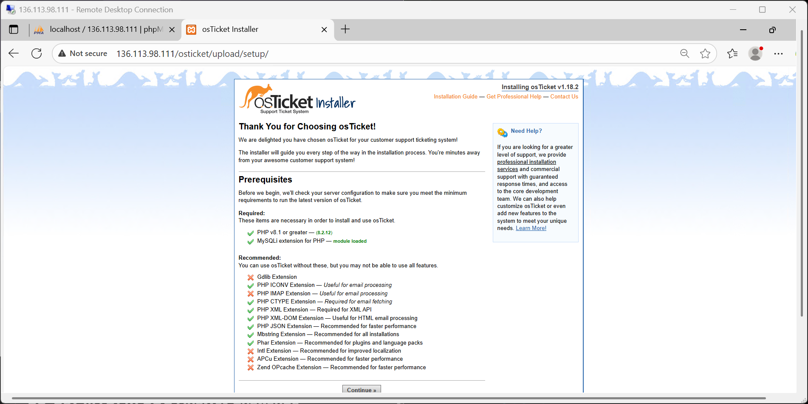
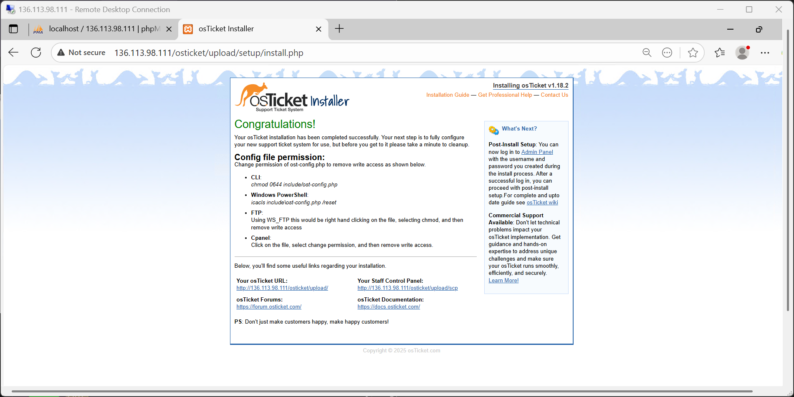
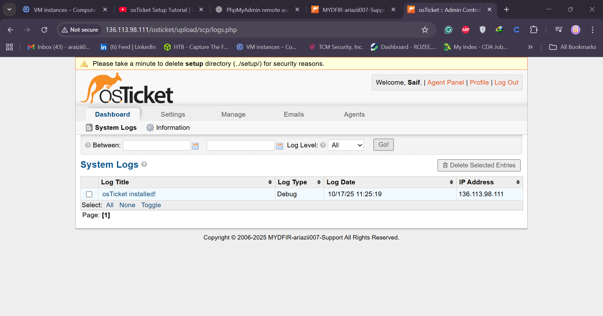

# 🧠 Day 24 — Setting Up and Configuring osTicket | 30-Day Mind Defer SOC Analyst Challenge

Welcome to **Day 24** of the **30-Day Mind Defer SOC Analyst Challenge**, a practical journey designed to help aspiring SOC Analysts gain hands-on experience.  
By the end of this session, you will have successfully **set up and configured osTicket**, a powerful open-source ticketing system that will be integrated into your SOC workflow later in the challenge.

---

## 🎯 Objective
Set up a **fully functional osTicket instance** on a cloud Windows Server (Windows Standard 2022) using **XAMPP** as the local web and database server.

---

## 🧱 Step 1: Deploy a Windows Server on Vultr

1. Log in to [Google Cloud Service](https://console.cloud.google.com/).
2. Click **Deploy** → **Deploy New Server**.
3. Under **Compute Type**, select:
   - **Cloud Compute (Shared CPU)**
4. Choose your **location** (e.g., *us-central1a*).
5. For **Operating System**, select:
   - **Windows server 2022**
6. Choose a plan (minimum requirements):
   - **1 vCPU**
   - **2 GB RAM**
   - **55 GB SSD**
7. Disable:
   - Auto Backup
   - IPv6
8. Enable:
   - Virtual Private Cloud (VPC)
9. Keep the Firewall Group empty for now.
10. Set hostname:
   ```
   osticket-vm
   ```
11. Click **Deploy Now** and wait for provisioning (~6 minutes).

---

## 🖥️ Step 2: Access the Server

- Once the instance is deployed, open the **Console**.
- Log in using the provided Administrator credentials.
- Prefer **RDP** (Remote Desktop Protocol) access for smoother control.
- Copy the password and use **Administrator** as the username.

---

## 🔥 Step 3: Configure Firewall

Since osTicket will be a web server accessible externally:

1. Go to **Vultr → Settings → Firewall**.
2. Create or attach a firewall (e.g., *30-Day MyDFIR SOC Challenge Firewall*).
3. Allow only **authorized IPs** (your analyst machine) to access the web server.
4. Later, ensure ports **80** (HTTP) and **443** (HTTPS) are open.

---
## 

## ⚙️ Step 4: Install XAMPP (Web Server)

1. Search for “XAMPP download” and open [ApacheFriends.org](https://www.apachefriends.org/download.html).
2. Download **XAMPP version 8.2.2** (or latest 8.x version).
3. Run the installer:
   - Accept warnings → Next
   - Keep default components selected.
   - Note installation path:
     ```
     C:\xampp
     ```
4. Complete setup and launch the **XAMPP Control Panel**.

---

## 🧩 Step 5: Configure Apache & phpMyAdmin

### 5.1 Apache Configuration

1. Go to:
   ```
   C:\xampp
   ```
2. Open **properties/configuration file** in Notepad.
3. Change the **ServerName** from:
   ```
   localhost
   ```
   to your public IP address (example):
   ```
   155.138.137.117
   ```
4. Save and close.

### 5.2 phpMyAdmin Configuration

1. Navigate to:
   ```
   C:\xampp\phpMyAdmin\
   ```
2. Backup the file:
   ```
   config.inc.php → config.inc-backup.php
   ```
3. Edit `config.inc.php`:
   - Find:
     ```php
     $cfg['Servers'][$i]['host'] = '127.0.0.1';
     ```
   - Replace with your **public IP address**:
     ```php
     $cfg['Servers'][$i]['host'] = '155.138.137.117';
     ```
4. Save changes.

---

## 🔒 Step 6: Configure Windows Firewall Rules

1. Open **Windows Defender Firewall with Advanced Security**.
2. Click **Inbound Rules → New Rule**.
3. Select **Port → TCP → Specific ports: 80,443**.
4. Choose **Allow Connection** → Name it:
   ```
   Inbound 80,443
   ```
5. Save rule.

---

## 🚀 Step 7: Start Apache and MySQL

1. Open **XAMPP Control Panel**.
2. Click **Start** for:
   - **Apache**
   - **MySQL**
3. Click **Admin** under Apache → open browser → select **phpMyAdmin**.

If you see:
> "Cannot connect: invalid settings"

You need to revert configuration and authorize access properly.

---

## 🧰 Step 8: Fix phpMyAdmin Access Issue

1. Revert `config.inc.php` host back to:
   ```php
   127.0.0.1
   ```
2. Restart Apache & MySQL.
3. Access phpMyAdmin locally.
4. Go to **User Accounts → root@localhost → Edit Login Information**.
5. Change Hostname:
   ```
   Use text field → 155.138.137.117
   ```
6. Set a new password:
   ```
   Winter2024!
   ```
7. Save changes.

Repeat for user **pma** (phpMyAdmin account).  
Update their credentials in `config.inc.php` accordingly.

---

## 

## 💾 Step 9: Download and Install osTicket

1. Go to [osTicket.com](https://osticket.com).
2. Click **Self-Hosted → Download**.
3. Download version **1.18.1** (or latest).
4. Extract files → locate `upload` directory.
5. Copy all contents inside `upload` to:
   ```
   C:\xampp\htdocs\osticket\
   ```

---

## 🧠 Step 10: Run osTicket Installer

1. Open browser → navigate to:
   ```
   http://<your_public_ip>/osticket/upload
   ```
2. Continue setup.
3. Rename file:
   ```
   include/ost-sampleconfig.php → ost-config.php
   ```
4. Refresh installer page.

---
## 

## 🧩 Step 11: Configure osTicket

1. Fill in form details:
   - Helpdesk Name: `Araizii - Support`
   - Username: `Araizii`
   - Password: `Winter2024!`
2. Database Settings:
   - Host: `<your_public_ip>`
   - Username: `root`
   - Password: `Winter2024!`
   - Database: `Araizii_30day_db`

> ❗ If installation fails (“page not working”), manually create the database first.

---

## 🛠️ Step 12: Manually Create Database

1. Open phpMyAdmin → Click **New Database**.
2. Name it:
   ```
   mydfir_30day_db
   ```
3. Click **Create**.
4. Assign privileges to root user:
   - Click **User Accounts → root → Databases**
   - Select the new DB → Check All Privileges → Save.

Retry osTicket installation afterward.

---

## ✅ Step 13: Finalize Installation

Once completed, you’ll see:
> “Congratulations! Your osTicket installation has been completed successfully.”

Run PowerShell as Administrator and reset permissions:

```powershell
cd "C:\xampp\htdocs\osticket\upload\include"
icacls .\ost-config.php /reset
```

You should see:
> “Successfully processed 1 file.”

---
## 

## 🌐 Step 14: Access osTicket

osTicket provides two main URLs:

- **Client Portal:**
  ```
  http://<public_ip>/osticket
  ```
- **Staff / Admin Portal:**
  ```
  http://<public_ip>/osticket/scp
  ```

Log in with:
```
Username: mydfir
Password: Winter2024!
```

---

## 👨‍💼 Step 15: Admin Configuration

Once logged in:
- Navigate to **Admin Panel** (top right).
- Customize:
  - System name & title
  - Support departments
  - Agent accounts (Add New Agent)
- You can now start managing tickets.

---
## 

## 🧩 Summary

You have successfully:
✅ Deployed a Windows Server on Vultr  
✅ Installed and configured XAMPP  
✅ Fixed phpMyAdmin access permissions  
✅ Installed and configured osTicket  
✅ Verified functionality and admin access  

---

## 🚀 Next Steps

In **Day 25**, we’ll integrate **osTicket** into our SOC tool stack so that whenever alerts are triggered, **tickets are automatically created and tracked** in osTicket.

---

## 🧠 Key Takeaways

- osTicket is an essential ticketing system for managing SOC alerts.
- XAMPP simplifies hosting web applications on Windows servers.
- Proper firewall and database configurations are crucial for security.
- Manual database creation often resolves permission and connection issues.

---
