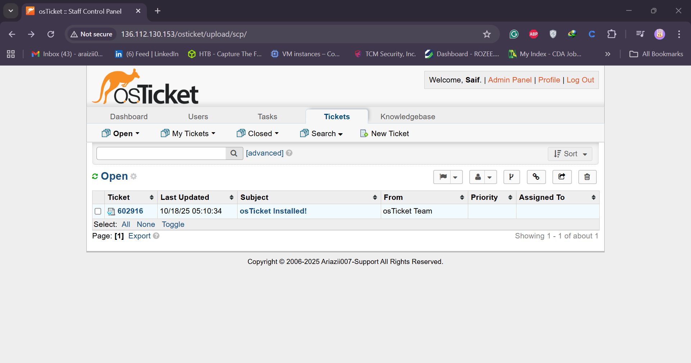
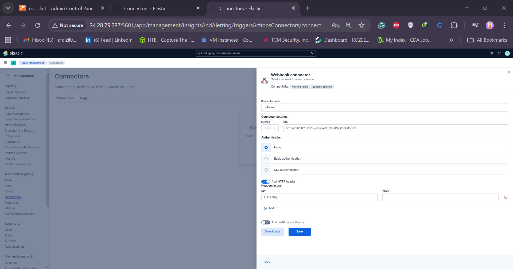
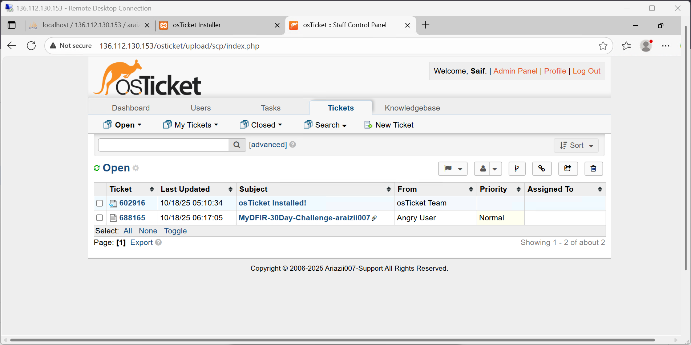

# 🧠 Day 25 - Integrating OS Ticket with Elasticsearch (MyDFIR 30-Day SOC Analyst Challenge)

Welcome to **Day 25** of the **30-Day MyDFIR SOC Analyst Challenge**, a challenge created to help aspiring SOC analysts gain practical, hands-on experience in 30 days.

If you haven’t started from Day 1 yet, it’s highly recommended that you begin there.  
By the end of this session, you will have successfully **integrated OS Ticket into your Elastic Stack** and confirmed the integration by sending a test alert into OS Ticket.

---

## 🎯 Objective

Integrate **OS Ticket** with **Elasticsearch** to automatically generate tickets from alerts created within the Elastic Stack.

---

## 🧩 Step 1: Accessing OS Ticket Admin Panel

1. Open your **OS Ticket Control Panel**.
2. Navigate to the **Admin Panel** by clicking on **Admin** at the top-right corner.
3. Go to **Manage → API**.
4. Click **Add New API Key**.

For the IP address:

- If your OS Ticket server and ELK server are in the same **Virtual Private Cloud (VPC)**, use your **private IP address** of the ELK server.
- Otherwise, use your **public IP address**.

### Example

If your ELK server’s private IP is:

```
172.31.0.3
```

Use that as your API key IP.

To confirm your private IP, go to your cloud provider (e.g., Vultr) → Select your ELK instance → Click **Settings → VPC 2.0** → Note the private IP address.

5. Under **Services**, check **Can Create Tickets**.
6. Add internal notes (optional). Example:

```
Araizii 30-Day Elastic Connector
```

7. Click **Add Key**.
8. Copy the generated **API Key** and store it securely (e.g., Notepad).
   ```text
   API Key: xxxxxxxxxxxxxxxxxxxxxxxxxxxxxxx
   ```

## 

---

## ⚙️ Step 2: Configuring Connector in Elasticsearch

1. Open **Elasticsearch (Kibana)**.
2. Click on the **hamburger icon (☰)** → Scroll down to **Stack Management**.
3. Under **Alerts and Insights**, select **Connectors**.
4. Click **Create Connector**.

> ⚠️ Note: With a free Elastic license, API connectors are unavailable. You must enable a **30-day trial**.

### Enable 30-Day Trial

- Click **Manage License → Start 30-Day Trial → Confirm**.  
  Now, API and third-party integrations are enabled.

---

## 🔌 Step 3: Create Webhook Connector

1. Under **Create Connector**, choose **Webhook**.
2. Name it:
   ```
   OS Ticket
   ```
3. Choose **POST** as the request method.

### Webhook URL

Use the following format:

```
http://<OS_TICKET_PUBLIC_IP>/osticket/api/tickets.xml
```

Example:

```
http://155.x.x.117/osticket/api/tickets.xml
```

### Authentication

- Set to **None**.

### HTTP Header

Add a new header:

```
Key: X-API-Key
Value: <Your OS Ticket API Key>
```

Click **Save & Test**.

## 

---

## 🧾 Step 4: Add Request Body (XML Payload)

To send a test request, use the **example XML payload** from the official OS Ticket GitHub.

Example payload:

```xml
<ticket>
  <email>user@example.com</email>
  <name>User Name</name>
  <subject>Araizii 30-Day Challenge - <your_handle></subject>
  <message>This is a test alert from Elasticsearch integration.</message>
  <ip>127.0.0.1</ip>
</ticket>
```

> 🔹 Replace `<your_handle>` with your username.  
> Example:
>
> ```
> Araizii 30-Day Challenge - araizii
> ```

---

## 🧠 Step 5: Troubleshooting Connection Issues

If you receive:

```
Error calling webhook: request failed timeout of 60,000ms
```

### Troubleshooting Steps

1. **SSH** into your ELK server:
   ```bash
   ssh root@<ELK_PUBLIC_IP>
   ```
2. Check your ELK private IP:

   ```bash
   ip a
   ```

   Example output:

   ```
   172.31.0.3
   ```

3. Try pinging your OS Ticket server:
   ```bash
   ping 172.31.0.5
   ```

If you see:

```
Destination host unreachable
```

You likely need to **configure the private IP** for your OS Ticket network adapter.

---

## 🖧 Step 6: Fixing OS Ticket Private IP (Windows)

1. On your OS Ticket VM, open **Control Panel → Network and Internet → View Network Status and Tasks → Change Adapter Settings**.
2. Identify the adapter with the `169.x.x.x` IP (unavailable private IP).
3. Right-click it → **Properties** → Double-click **Internet Protocol Version 4 (TCP/IPv4)**.
4. Select **Use the following IP address** and enter:
   ```
   IP Address: 172.31.0.5
   Subnet Mask: 255.255.255.0
   ```
5. Click **OK → OK**.

Verify the change:

```bash
ipconfig
```

Now, your OS Ticket server should have the correct private IP.

Back on your ELK server, test the connection again:

```bash
ping 172.31.0.5
```

✅ Successful ping means connectivity restored.

---

## 🚀 Step 7: Re-Test the Webhook Connector

1. In **Elasticsearch → Connectors**, update your webhook URL to use the **private IP**:
   ```
   http://172.31.0.5/osticket/api/tickets.xml
   ```
2. Click **Save and Run Test**.

If successful, you’ll see:

```
Test was successful. Ensure the results are what you expect.
```

---

## 🧾 Step 8: Verify Ticket in OS Ticket

1. Go to your **OS Ticket Agent Panel** (top-right corner).
2. You’ll see a new ticket:
   ```
   Araizii 30-Day Challenge - StevenRocks
   ```
   🎉 **Integration Successful!**

## 

---

## 🧭 Recap

You’ve achieved the following milestones:

- Deployed your **Elastic Stack** and integrated **Windows/Linux agents**.
- Created **alerts and dashboards** for SSH and RDP brute-force detection.
- Identified a **C2 framework (Mythic)**.
- Integrated **OS Ticket** as a **ticketing system** for automated incident tracking.
- Completed the **AAA (Authentication, Authorization, Accounting)** model by implementing **Accounting (Auditing)** through OS Ticket.

You now have a **fully functional SOC environment** to begin simulating and investigating alerts.

---
