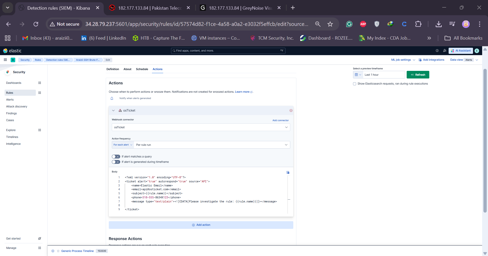
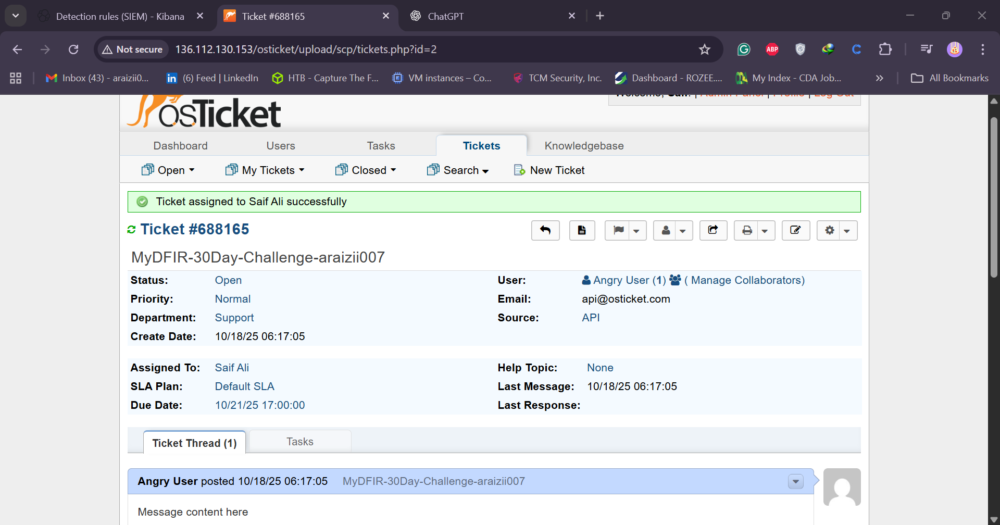

# Day 26 - SSH Brute Force Alert Investigation

**Author:** Syed Saif Ali Shah
**Challenge:** MyDFIR SOC Analyst 30-Day Challenge
**Topic:** Day 26 – SSH Brute Force Alert Investigation

Welcome to **Day 26 of the 30-Day SOC Analyst Challenge**, designed to help aspiring SOC analysts gain practical experience.  
By the end of this day, you'll learn how to **investigate an SSH Brute Force alert**, understand what to look for, and how to integrate alerts with **osTicket** for efficient case management.

---

## 🎯 Objective

Investigate SSH brute force alerts in Elastic Security, determine whether the activity is malicious, and forward alerts to osTicket for tracking.

---

## 🧭 Steps Overview

### 1. Accessing Alerts

- Go to the hamburger icon → **Security Tab → Alerts**.
- View all alerts generated by previous detections (e.g., SSH brute force).
- Select one alert (e.g., from August 14).

Elastic provides a feature called **Timelines** for investigation and threat hunting.  
Timelines allow analysts to correlate events and visualize suspicious activity efficiently.

---

### 2. Investigative Methodology

When investigating SSH brute force activity, focus on these questions:

1. **Is the IP known for brute force attacks?**

   - Use tools like **AbuseIPDB** and **GreyNoise** to check threat intelligence data.
   - Example finding:
     - IP `182.177.133.84` reported **1,816 times** with **100% abuse confidence**.
     - GreyNoise shows tags like `SSH brute forcer`, `zmap client`, `TLS crawler`.

2. **Were other users affected by this IP?**

   - Use Kibana Discover tab.
   - Search for the IP and filter events using the field `user.name`.
   - Example users found: `root`, `oracle`, `guest`, and `test`.

3. **Were any login attempts successful?**

   - Query logs for keywords like `Accepted` (case-sensitive).
   - If no successful logins are found → mark as **unsuccessful brute force attempt**.

4. **If successful, what happened next?**
   - Look for post-login activity such as downloading scripts, privilege escalation, or persistence actions.

---

### 3. Documentation of Findings

| Question                              | Answer                                             |
| ------------------------------------- | -------------------------------------------------- |
| Is IP known for brute force activity? | ✅ Yes (Confirmed via AbuseIPDB and GreyNoise)     |
| Were other users affected?            | ✅ Yes (root, oracle, guest, test)                 |
| Were any logins successful?           | ❌ No                                              |
| Follow-up actions                     | Close the alert after documenting in ticket system |

---

### 4. Integrating Elastic Alerts with osTicket

To streamline case management, configure Elastic detection rules to send alerts to **osTicket** via **Webhook**.

**Steps:**

1. Go to **Rules → Detection Rules → SSH Brute Force Attempt**.
2. Click **Edit Rule Settings** → **Actions → Add Webhook**.
3. Select **osTicket** as the webhook destination.
4. Customize body message variables:
   ```text
   {
     "alert": true,
     "autorespond": true,
     "source": "API",
     "name": "Elastic Email",
     "email": "api@ot.com",
     "subject": "{{rule.name}}",
     "message": "Please investigate the rule: {{rule.name}}"
   }
   ```
5. Click **Save Changes**.

After saving, Elastic will automatically send alert data to osTicket.

## 

---

### 5. Configuring Kibana URL for osTicket Links

To make alerts clickable from osTicket:

1. Edit the Kibana configuration file:
   ```bash
   sudo nano /etc/kibana/kibana.yml
   ```
2. Add the following:
   ```yaml
   server.publicBaseUrl: "http://elk-vm-Ip:5601"
   ```
3. Save and restart Kibana:
   ```bash
   sudo systemctl restart kibana.service
   ```

Now osTicket alerts will include a direct hyperlink to the Elastic alert.

---

### 6. Managing and Closing Tickets

1. Assign the ticket to yourself or another analyst.
2. Document your investigation details in the **reply section**.
3. After resolving, close the ticket with an appropriate reason (e.g., _Closing as test_).
4. All actions will appear in the osTicket audit trail.

## 

---

## 🧠 Key Takeaways

- Always verify IP reputation using **AbuseIPDB** and **GreyNoise**.
- Look for **usernames targeted** and **success/failure patterns**.
- Configure **Elastic Webhook** to integrate with **osTicket** for efficient alert handling.
- Maintain structured **ticket documentation** for every incident.
- If the attack was unsuccessful, close the ticket with proper reasoning.

---
