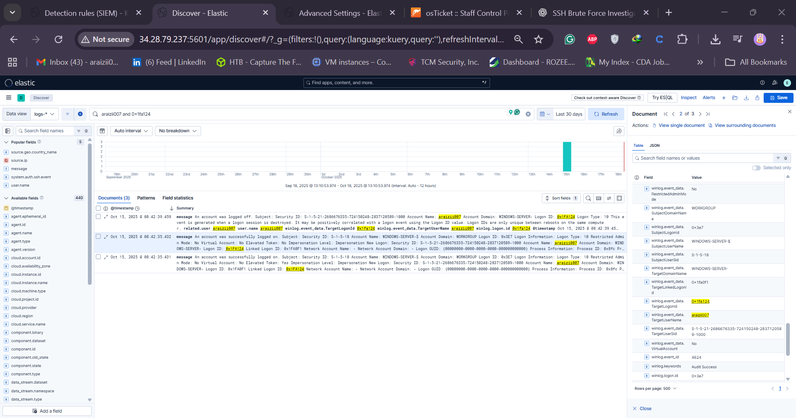

# Day 27 — RDP Brute Force Investigation

**Summary**

A step-by-step investigation guide for Day 27 of the 30‑day "My DFIR / SOC Analyst" challenge. This document explains how to triage and investigate RDP brute force alerts using a SIEM / web GUI, perform enrichment (AbuseIPDB, GreyNoise), confirm successful logons, pivot using Logon IDs, and build a timeline of suspicious activity.

---

## Goals

- Triage an RDP brute force alert.

- Answer four core questions for brute force investigations:

  1. Is the source IP known for brute force or scanning activity?
  2. Are other user accounts affected?
  3. Were any logon attempts successful?
  4. If successful, what happened after the successful login?

- Produce a short timeline and next-step runbook for remediation and hunting.

---

## Pre-requisites

- Access to your SIEM / web GUI (Discover, Alerts, Rules, Dashboards).
- Ability to run queries (filter by `source.ip`, `user.name`, and `event.code`).
- External enrichment access: AbuseIPDB, GreyNoise (or equivalents).
- Notes/logbook to record findings (date/time in UTC recommended).

---

## Investigation Overview (High Level)

1. Open the web GUI → **Alerts** (Security) and set the time range to **30 days**.
2. Filter alerts for **RDP Brute Force** and pick a representative alert to investigate.
3. Collect initial alert fields: `source.ip`, `user.name`, number of events, timestamps.
4. Enrich the IP using AbuseIPDB and GreyNoise to determine reputation and intent.
5. Search Discover / raw event store for all events from the `source.ip` within the 30‑day window.
6. Check `user.name` distribution to see which accounts were targeted.
7. Search for successful logons: filter on `event.code:4624` (Windows security successful logon).
8. If successful logon(s) exist, capture the `Logon ID` and host (`host.name`) — pivot to find all events with that Logon ID to reconstruct session activity.
9. Build a timeline (start — potential compromise — end) and document persistence, lateral movement, process creation, C2 callbacks or exfiltration.

---

## Detailed Steps (Walkthrough)

### 1) Identify the alert and capture key metadata

- From Alerts view, filter for **RDP Brute Force**.
- Open the alert details and note:

  - `source.ip` (example: `81.x.x.x`)
  - `user.name` (example: `Administrator`)
  - Number of events that triggered the alert and the alert timestamp.

### 2) Enrich the source IP

- AbuseIPDB: look up reputation — number of reports, abuse confidence, reported categories (RDP brute force, spam, web-bot, etc.), country of origin.
- GreyNoise: check for scanning behavior vs. targeted activity. GreyNoise tags (e.g., `RDP crawler`) and intent classification (unknown, benign, malicious) are helpful.

Record results of enrichment and decide if the IP is likely malicious or just internet background noise.

### 3) Look for other affected accounts

- In Discover, set the same 30‑day time range and search for the IP (`source.ip: <ip>`).
- Inspect the `user.name` field to see distribution. If `Administrator` (or one account) is 100%, note that — otherwise list any additional users or host accounts (host accounts often end with `$`).

### 4) Confirm if any attempts were successful

- Successful Windows logons create events with `event.code:4624`.
- Query: `source.ip: <ip> AND event.code:4624` (or filter on `event.code:4624` then filter by IP) — if zero results, no successful logons from that IP.
- If you get matches, note the count and exact timestamps.

### 5) Pivot using Logon ID

- Expand a successful `4624` event and capture the `Logon ID` (also called Logon Identifier).
- Query your logs for the same `Logon ID` (and `user.name`) to capture all events for that session — this reveals privilege assignments, process creations, logoffs, and other actions tied to the session.
- Typical sequence for an automated brute force session: `Special privileges assigned to new logon` → immediate `Logoff` (indicating a scanner that validated credentials then exited).

### 6) Build the session timeline

- Choose the earliest successful logon timestamp as **Potential Start** (record in UTC).
- Choose the `Logoff` or last event tied to the `Logon ID` as **Potential End** (record in UTC).
- With the time window defined, search for suspicious activity in that window:

  - `process_creation` events (command shells, PowerShell, wscript, rundll32,
  - New service creation
  - Lateral movement events (SMB, WMI, PSExec usage)
  - Outbound network connections (possible C2)
  - Data access or unusual file reads/writes (possible exfil)

### 7) Document findings and artifacts

- Items to include in your ticket / report:

  - Source IP and enrichment (AbuseIPDB/GreyNoise results)
  - Affected user(s)
  - Whether authentication succeeded (Y/N) and timestamps
  - `Logon ID`(s) used
  - Host(s) involved
  - Timeline with UTC timestamps (start/end)
  - Notable events during the session (processes, privilege escalations, lateral movement, exfil)
  - Recommended mitigation steps (see below)

---

## Example Findings (template)

- **Source IP:** `81.x.x.x` — AbuseIPDB: 55 reports, abuse confidence 48%, country: Russia. GreyNoise: `RDP crawler`, unknown intent.
- **Accounts targeted:** `Administrator` only (100% of events)
- **Successful logons:** No — `event.code:4624` returned 0 results for this IP. (If yes, list timestamps)
- **If successful:** Example session started `2024-08-12T19:56:05Z` and ended `2024-08-13T11:33:34Z` (UTC) — Logon ID `0x3e7...` — actions observed: `Special privilege assigned`, `Logoff` — interpreted as automated brute force scan that found a credential and exited.

> Note: The above timestamps are sample values — always capture exact event timestamps from your SIEM and convert them to UTC for reporting.

---

## Remediation & Next Steps (Runbook)

1. If the IP is confirmed malicious or repetitive, add to your blocklist at perimeter devices (firewall/IDS) — preferably after confirming no false positives and after consulting change control.
2. Reset or rotate credentials for any account that had successful logons (especially `Administrator` or other privileged accounts).
3. Check the affected host(s) for persistence (services, scheduled tasks, new user accounts, autoruns).
4. Hunt for lateral movement originating from the affected host during the session window.
5. Collect forensic artifacts (memory, disk, event logs) if compromise is suspected.
6. Improve alerting: tune brute force rule thresholds, add enrichment automation (AbuseIPDB/GreyNoise lookups), and create tickets automatically (webhook to osTicket as described).
7. Consider implementing additional hardening: RDP rate-limiting, MFA for RDP, disable RDP for accounts that don’t need it, JIT admin access.

---

## Useful Queries

- All events from IP (last 30 days): `source.ip: <IP>`
- Users targeted by IP: `source.ip: <IP> | stats count by user.name`
- Successful logons from IP: `source.ip: <IP> AND event.code:4624`
- Events by Logon ID and username: `user.name: "Administrator" AND logon.id: "<LogonID>"`

---

## Artifacts to Save

- Screenshots of alert details and enrichment results.
- Raw event export (CSV/NDJSON) for the session time window.
- Notes with final timeline and decisions.

## 

---

## References / Tools

- AbuseIPDB — IP reputation reports
- GreyNoise — internet scanner classification and tags
- SIEM docs — how to export logs and pivot on fields

---

## Appendix — Reporting template (markdown)

Use this short template when adding the incident to your tracking system (osTicket, JIRA, etc.):

```
**Title:** RDP Brute Force Alert — <IP> targeting <user>
**Source IP:** <IP> (AbuseIPDB: <score>, GreyNoise: <tag>)
**Time window (UTC):** <start> — <end>
**Affected hosts:** <host list>
**Successful authentication:** <Yes/No>
**Logon ID(s):** <id list>
**Observed activity:** <short bullets — process creates, network connections, persistence>
**Recommended action:** <isolate host / reset creds / block IP / collect forensics>
```

---
