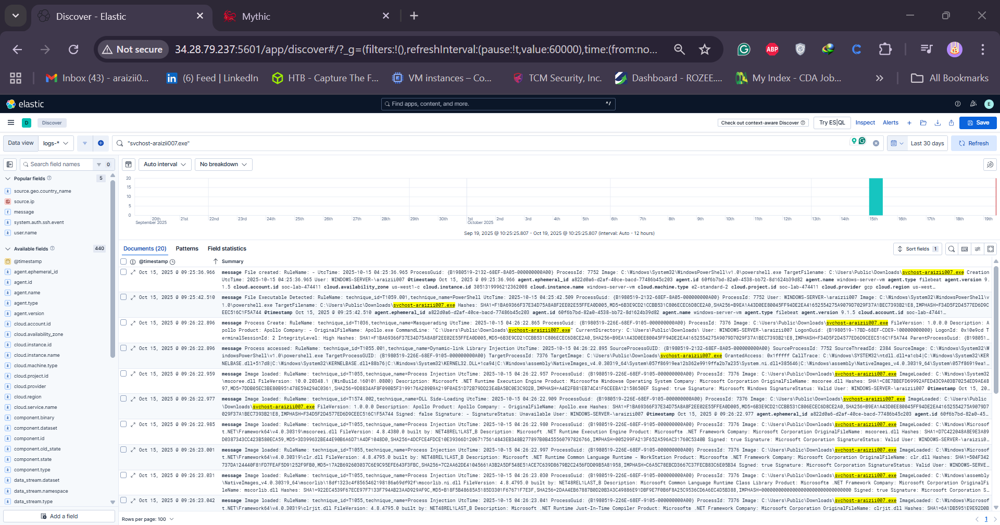
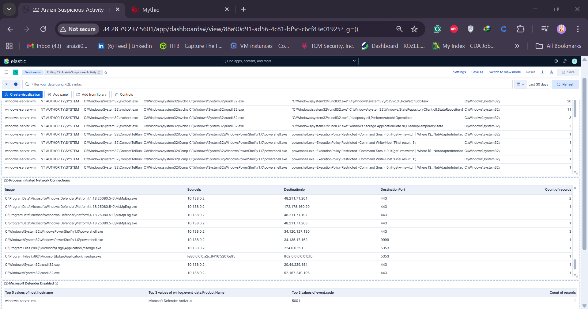
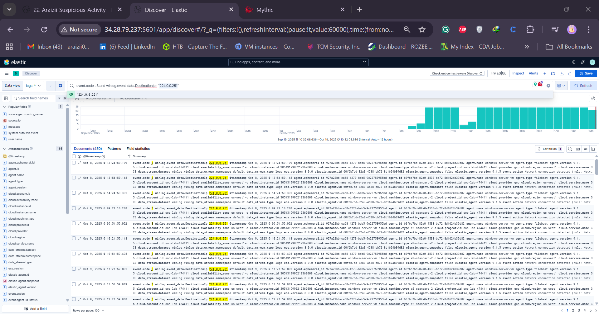
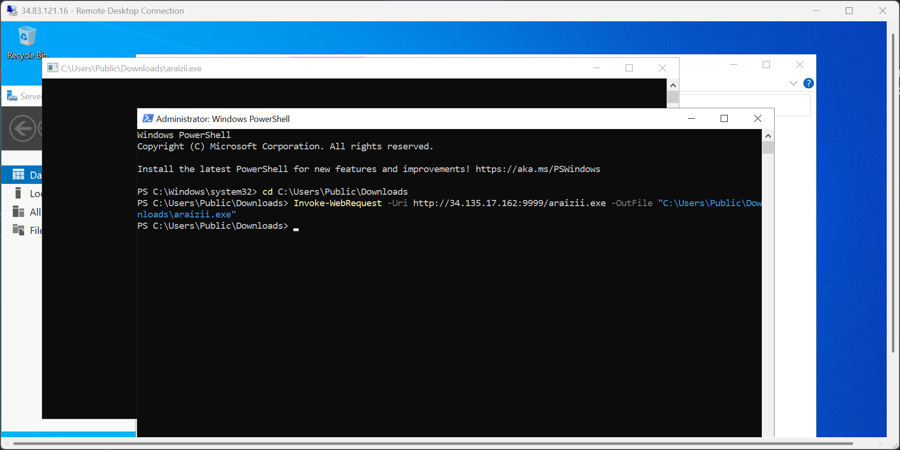
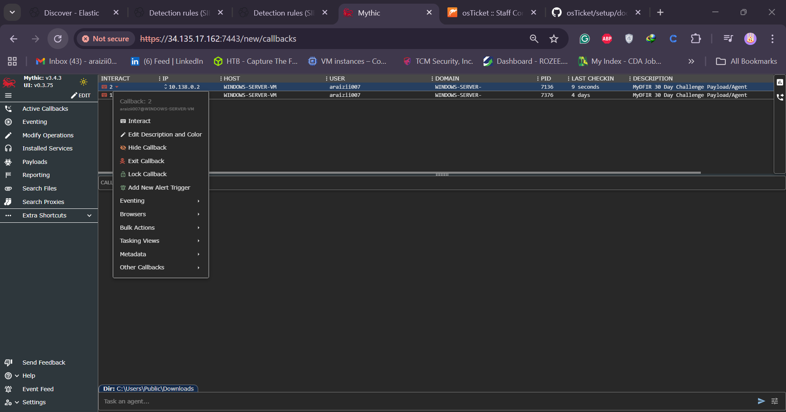
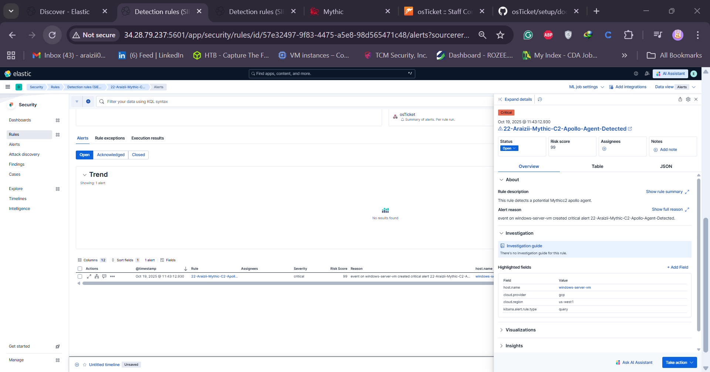
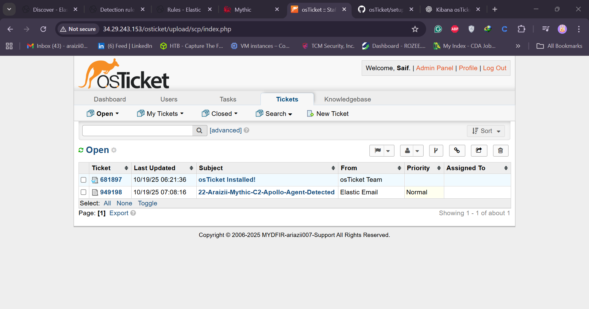
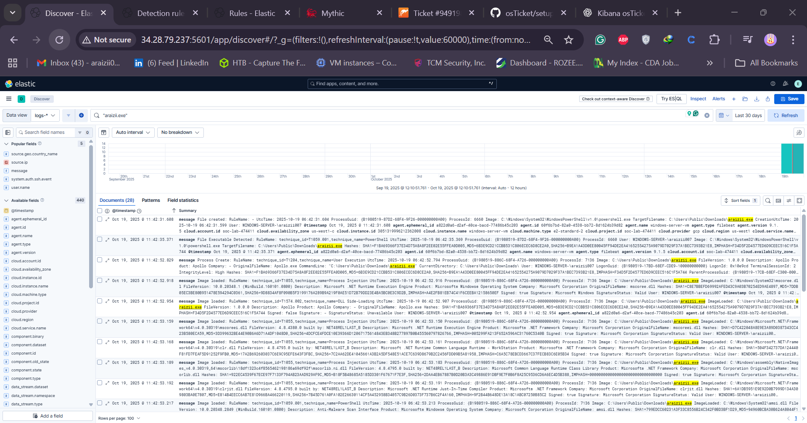
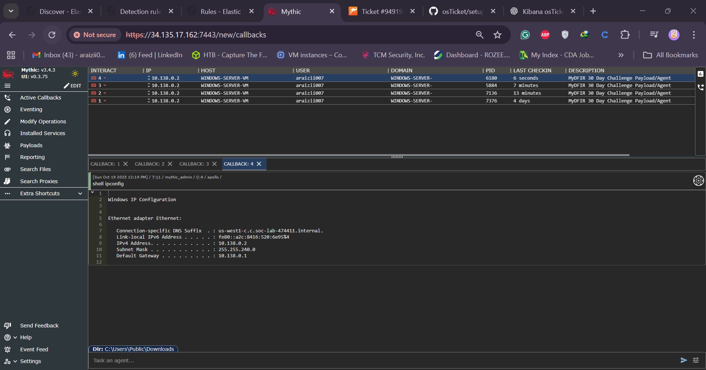

# 🧠 Day 28: Investigating Mythic Command and Control (C2) Activity

### 🕵️ SOC Analyst 30-Day Challenge

Welcome to **Day 28** of the 30-Day SOC Analyst Challenge!  
In this lab, we explore **Mythic Command and Control (C2)** detection, log correlation, and automated incident response using **Kibana**, **Sysmon**, and **osTicket**.

---

## 🎯 Objective

The objective of this investigation is to understand how advanced adversaries leverage **C2 frameworks** to maintain persistence and control over compromised systems.  
You will learn how to:

- Identify C2-related activities within endpoint logs.
- Analyze Sysmon events for PowerShell execution and network beacons.
- Configure detection rules in **Kibana**.
- Automate SOC workflows by sending alerts to **osTicket**.

---

## 

## 

## 

## ⚙️ Environment Setup

| Component                  | Description                                                                                 |
| -------------------------- | ------------------------------------------------------------------------------------------- |
| **Mythic C2 Framework**    | Used to simulate an adversary establishing control over a victim endpoint.                  |
| **Sysmon**                 | Provides detailed telemetry on process creation, registry changes, and network connections. |
| **Elasticsearch & Kibana** | Centralized log collection and visualization platform for SOC analysts.                     |
| **osTicket**               | Ticketing system used to track alerts and incidents.                                        |
| **Windows 10 Endpoint**    | Simulated victim host where the Mythic agent was executed.                                  |

### 🖧 Network Architecture

```
Attacker (Mythic C2 Server)
        ↓
Compromised Host (Windows 10 + Sysmon)
        ↓
Sysmon Event Logs → Elasticsearch → Kibana Dashboard
        ↓
Alert Trigger → osTicket (Incident Creation)
```

---

## 🧩 Step 1: Introduction to Mythic C2

**Mythic** is a post-exploitation framework similar to Cobalt Strike, providing command modules, payload generation, and remote agent management.

**Capabilities include:**

- Payload deployment via PowerShell, HTTP, or SMB.
- Command execution and data exfiltration.
- Plugin support for lateral movement and privilege escalation.

In our lab, Mythic was installed and accessed via its **web UI on port 7443**, and an HTTP-based payload was deployed on a target Windows VM.

---

## 

## 

## 📊 Step 2: Analyzing Sysmon Logs in Kibana

After executing the Mythic payload on the endpoint, Sysmon began capturing events. These logs were forwarded to **Elasticsearch**, and visualized in **Kibana**.

### 🧾 Key Sysmon Events

| Event ID | Description               | Detection Insight                                            |
| -------- | ------------------------- | ------------------------------------------------------------ |
| 1        | **Process Creation**      | Suspicious PowerShell or cmd.exe launching unknown binaries. |
| 3        | **Network Connection**    | Outbound traffic to Mythic C2 IP or domain.                  |
| 11       | **File Creation**         | Payload written to temporary directory or user profile.      |
| 13       | **Registry Modification** | Persistence achieved via `Run` key.                          |

**Example Kibana Query:**

```kql
(event.code:1 AND process.command_line:"powershell*") OR (event.code:3 AND destination.ip:*)
```

**Result:** PowerShell executed a base64-encoded command that fetched a payload from the Mythic server (192.168.56.120).

---

## 🚨 Step 3: Creating Detection Rules in Kibana

A detection rule was created under:

> **Stack Management → Rules and Connectors**

### Rule Configuration:

| Setting       | Value                                                    |
| ------------- | -------------------------------------------------------- |
| **Name**      | Mythic C2 Detection                                      |
| **Index**     | winlogbeat-\*                                            |
| **Condition** | PowerShell process creating outbound network connections |
| **Severity**  | High                                                     |
| **Action**    | Send alert to osTicket via webhook                       |

**Webhook Integration Steps:**

1. Create a new **Webhook connector** in Kibana.
2. Paste your osTicket API endpoint (e.g., `http://<osticket-server>/api/tickets.json`).
3. Map alert fields (host, timestamp, process, IP).
4. Save and test integration.

When the rule triggers, Kibana sends an alert payload directly to osTicket.

---

## 

## 🧾 Step 4: osTicket Incident Workflow

When an alert is received, osTicket generates a new ticket automatically.

**Example Ticket Details:**

| Field           | Description                 |
| --------------- | --------------------------- |
| **Subject**     | Mythic C2 Activity Detected |
| **Source**      | Kibana Webhook              |
| **Status**      | Open                        |
| **Priority**    | High                        |
| **Department**  | Security Operations Center  |
| **Assigned To** | SOC Analyst (Tier 1)        |

**SOC Analyst Response Steps:**

1. Validate the detection in Kibana (cross-check logs).
2. Confirm the presence of Mythic agent or PowerShell activity.
3. Isolate host using EDR or network control.
4. Collect evidence: memory dump, network captures, and registry exports.
5. Escalate if necessary to Tier 2 or Incident Response team.

## 

---

## 🧠 Step 5: Indicators of Compromise (IoCs)

| Type         | Value                                                | Description               |
| ------------ | ---------------------------------------------------- | ------------------------- |
| File Path    | `C:\Users\Admin\AppData\Local\Temp\myagent.exe`      | Mythic agent binary       |
| Command Line | `powershell.exe -enc ...`                            | Encoded payload execution |
| IP Address   | `192.168.56.120`                                     | C2 Server address         |
| Registry Key | `HKCU\Software\Microsoft\Windows\CurrentVersion\Run` | Persistence key           |

## 

## 

### 🧩 Mitigation Steps

- Quarantine affected systems.
- Block C2 IP at firewall and update threat feeds.
- Implement strict PowerShell execution policies.
- Enable script block logging and AMSI integration.
- Regularly audit Sysmon configurations and update detection rules.

---

## 🧰 Step 6: Lessons Learned

| Lesson                     | Description                                                           |
| -------------------------- | --------------------------------------------------------------------- |
| **Integration Matters**    | Linking Kibana alerts with osTicket improves SOC workflow efficiency. |
| **Proactive Detection**    | Well-tuned Sysmon and Elastic rules can identify C2 frameworks early. |
| **Automation Saves Time**  | Webhook-based alerting reduces manual analyst workload.               |
| **Continuous Improvement** | Regular tuning prevents alert fatigue and false positives.            |

---

## 🧾 Conclusion

This investigation successfully demonstrated how to detect and respond to **C2 activity** from the **Mythic framework** using integrated SOC tools.  
Through careful telemetry analysis, alert automation, and response coordination, analysts can drastically reduce detection and containment time during real-world attacks.

---
