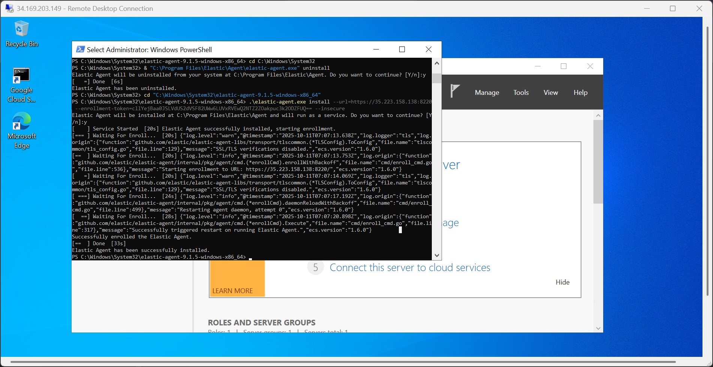
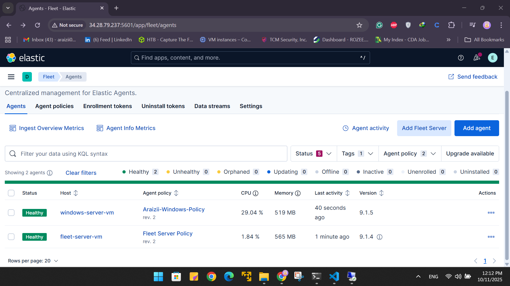

# 🧠 Day 7 — Fleet Server Setup & Elastic Agent Installation

Welcome to **Day 7** of the **30-Day MyDFIR for SOC Analyst Challenge**!  
In this session, we’ll set up a **Fleet Server** and install the **Elastic Agent** on our Windows Server created back in **Day 5**.  
By the end of this documentation, you’ll have centralized management for all your agents through Fleet.

---

## 🚀 Objective

- Deploy and configure a **Fleet Server** on a new Ubuntu VM.  
- Install and enroll the **Elastic Agent** on your Windows Server.  
- Troubleshoot connectivity and enrollment issues between the Fleet Server and ELK.

---

## 🖥️ Step 1: Create the Fleet Server

1. Log in to your **cloud provider (e.g., Vultr)**.
2. Click **Deploy New Server**.
3. Select the following configuration:

   ```
   Location: Toronto  
   OS: Ubuntu 22.04  
   CPU: 1 vCPU  
   RAM: 4 GB  
   VPC Network: Selected (Private Cloud 2.0)  
   Firewall Group: Default or custom
   ```

4. Name your server:
   ```
   Araizii-Fleet-Server
   ```
5. Click **Deploy**.

---

## 🌐 Step 2: Access Kibana and Configure Fleet

1. Open your **Kibana Web GUI** using the ELK server’s public IP:
   ```
   http://<YOUR_ELK_PUBLIC_IP>:5601
   ```
2. Click the **☰ (hamburger icon)** on the left menu → scroll down → select **Fleet** under *Management*.
3. Click the **Add Fleet Server** button.
4. Choose **Quick Start** (sufficient for the challenge; use *Advanced* for production).

   **Configuration Example:**
   ```
   Fleet Server name: mydfir-fleet-server
   URL: https://<FLEET_SERVER_PUBLIC_IP>:8220
   ```

5. Click **Generate Fleet Server Policy**.  
   If you see `invalid URL` — make sure you included `https://` before your IP.

6. Once generated, **copy the installation command** for the Fleet Server.

---

## 🧩 Step 3: Install the Fleet Server on Ubuntu

1. SSH into your new Fleet Server:
   ```bash
   ssh root@<FLEET_SERVER_PUBLIC_IP>
   ```
2. Update system packages:
   ```bash
   apt update && apt upgrade -y
   ```
3. Paste and run the Fleet installation command copied from Kibana.  
   Example:
   ```bash
   sudo ./elastic-agent install --fleet-server-es=<ELASTICSEARCH_URL> --fleet-server-service-token=<TOKEN>
   ```

4. Confirm installation:
   ```
   Elastic Agent will be installed at /opt/Elastic/Agent and will run as a service.
   Continue? [y/n]: y
   ```

---

## 🛡️ Step 4: Firewall & Network Configuration

### Common Issues & Fixes

- **Issue:** `Fleet Server timed out waiting for Fleet Server to start`  
  **Fix:** Allow Elasticsearch’s default port:
  ```bash
  sudo ufw allow 9200
  ```

- **Issue:** Fleet Server cannot connect to ELK  
  **Fix:** Update your **network firewall rules** to allow inbound traffic between:
  - Fleet Server ↔ ELK (Ports **9200**, **8220**)
  - Fleet Server ↔ Agents (Ports **8220**, **443**)

Example:
```bash
sudo ufw allow 8220
sudo ufw allow 443
sudo ufw reload
```

After adjustments, rerun the agent installation command.

---

## ✅ Step 5: Successful Enrollment

Once ports are open and rules updated, you should see:

```
Elastic Agent enrolled successfully.
Fleet Server connected.
```

Head back to Kibana → **Fleet → Agents**, and you’ll see the connected Fleet Server.



---

## 🪟 Step 6: Install Elastic Agent on Windows Server

1. In Kibana, click **Add Agent**.
2. Create a new policy:
   ```
   Policy Name: mydfir-windows-policy
   Collects: System logs and metrics
   ```
3. Copy the generated **Windows installation command**.

4. On your **Windows Server**:
   - Open **PowerShell as Administrator**.
   - Paste and run the installation command.

   Example:
   ```powershell
   .\elastic-agent.exe install --url=https://<FLEET_SERVER_IP>:8220 --enrollment-token=<TOKEN>
   ```

5. If you see a certificate error:
   ```
   x509: certificate signed by unknown authority
   ```
   Add the `--insecure` flag to bypass the self-signed certificate check:
   ```powershell
   .\elastic-agent.exe install --url=https://<FLEET_SERVER_IP>:8220 --enrollment-token=<TOKEN> --insecure
   ```

6. The agent should now successfully enroll into Fleet:
   ```
   Elastic Agent has successfully installed.
   ```

---

## 🔍 Step 7: Verify in Kibana

1. Go to **Fleet → Agents**.  
   You should see your Windows Server (`mydfir-win-stephenrocks`) connected.

2. Navigate to **Discover** and search for:
   ```
   agent.name : "mydfir-win-stephenrocks"
   ```
3. You’ll start seeing **Windows logs**, including event codes like:

   ```
   Event ID: 4625  →  "An account failed to log on"
   ```

This confirms that the agent is correctly forwarding logs to Elasticsearch.


---

## 🧠 Summary

- Deployed and configured a Fleet Server on Ubuntu.  
- Installed and enrolled Elastic Agent on Windows Server.  
- Opened necessary firewall ports (8220, 9200, 443).  
- Troubleshot common connection and certificate errors.  
- Verified log ingestion in Kibana.

---